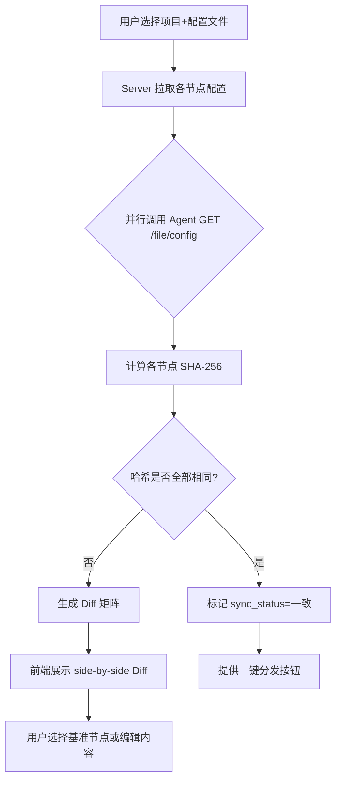
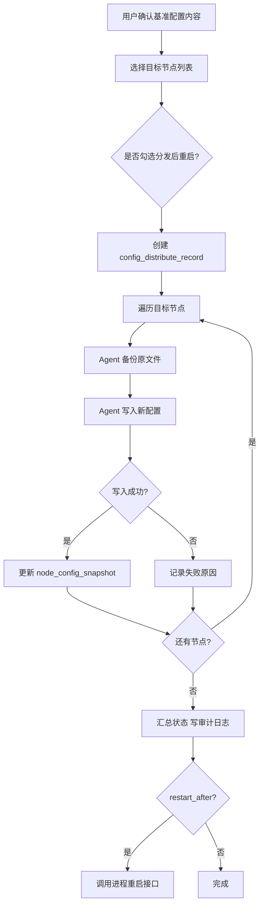
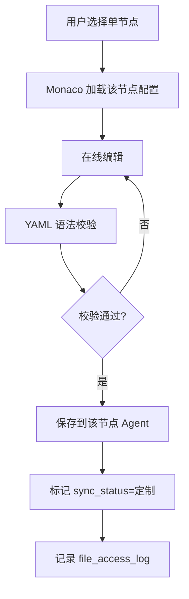

# 详细设计文档 v1.0 - 配置文件管理

## 1. 模块概述

配置文件管理模块面向「同一微服务多机部署、各节点 yml 可能不一致」的场景。每个项目仅维护**一份生产配置**（无 dev/test/prod 多环境维度）。提供跨节点配置读取、对比、编辑、批量/单独分发能力。

---

## 2. 系统架构

```
┌──────────────────────────────────────────────────────────────────┐
│  ConfigManageView.vue (前端)                                      │
│  ┌────────────┐ ┌────────────┐ ┌────────────┐ ┌────────────────┐ │
│  │ 项目/文件树 │ │ Diff 对比  │ │ Monaco编辑 │ │ 分发向导       │ │
│  └─────┬──────┘ └─────┬──────┘ └─────┬──────┘ └───────┬────────┘ │
└────────┼──────────────┼──────────────┼────────────────┼──────────┘
         │ REST         │              │                │
         ▼              ▼              ▼                ▼
┌──────────────────────────────────────────────────────────────────┐
│  Server: ConfigController / ConfigService                           │
│  ┌──────────────┐  ┌──────────────┐  ┌─────────────────────────┐ │
│  │ 配置元数据    │  │ Diff/Hash    │  │ DistributeOrchestrator  │ │
│  │ (H2)         │  │ 引擎         │  │ (并行 Agent 调用)        │ │
│  └──────────────┘  └──────────────┘  └─────────────────────────┘ │
│         │                  │                      │                │
│         │         AgentProxyController            │                │
└─────────┼──────────────────┼──────────────────────┼────────────────┘
          │                  │                      │
          ▼                  ▼                      ▼
┌──────────────────────────────────────────────────────────────────┐
│  Agent: FileController (扩展)                                     │
│  GET /file/config  POST /file/config  POST /file/config/backup   │
└──────────────────────────────────────────────────────────────────┘
          │
          ▼
   /home/stms/tm-server/config/application.yml  (目标节点磁盘)
```

---

## 3. 数据库设计

### 3.1 表：project_config_file（项目配置文件定义）

| 字段名 | 类型 | 长度 | 必填 | 主键 | 说明 |
|--------|------|------|------|------|------|
| id | BIGINT | — | 是 | PK | 自增 |
| project_id | BIGINT | — | 是 | — | 关联 project_info.id |
| file_name | VARCHAR | 200 | 是 | — | 显示名，如 application-prod.yml |
| relative_path | VARCHAR | 500 | 是 | — | 相对 deploy_dir，如 `config/application.yml`（每项目通常仅 1 条主配置） |
| is_primary | TINYINT | — | 否 | — | 是否主配置，默认 0 |
| remark | VARCHAR | 500 | 否 | — | 备注 |
| create_time | BIGINT | — | 是 | — | 毫秒时间戳 |
| update_time | BIGINT | — | 是 | — | 毫秒时间戳 |

**索引设计：**
- PRIMARY KEY (id)
- UNIQUE INDEX uk_project_path (project_id, relative_path)
- INDEX idx_project_id (project_id)

### 3.2 表：node_config_snapshot（节点配置快照）

| 字段名 | 类型 | 长度 | 必填 | 主键 | 说明 |
|--------|------|------|------|------|------|
| id | BIGINT | — | 是 | PK | 自增 |
| project_id | BIGINT | — | 是 | — | 项目 ID |
| node_id | BIGINT | — | 是 | — | 节点 ID |
| config_file_id | BIGINT | — | 是 | — | 关联 project_config_file.id |
| content_hash | VARCHAR | 64 | 是 | — | SHA-256 |
| content_size | INT | — | 否 | — | 字节数 |
| sync_status | TINYINT | — | 是 | — | 0=未知 1=一致 2=差异 3=定制 |
| last_sync_time | BIGINT | — | 否 | — | 最后同步时间 |
| update_time | BIGINT | — | 是 | — | 快照刷新时间 |

**索引设计：**
- PRIMARY KEY (id)
- UNIQUE INDEX uk_node_file (node_id, config_file_id)
- INDEX idx_project_sync (project_id, sync_status)

### 3.3 表：config_distribute_record（配置分发记录）

| 字段名 | 类型 | 长度 | 必填 | 主键 | 说明 |
|--------|------|------|------|------|------|
| id | BIGINT | — | 是 | PK | 自增 |
| project_id | BIGINT | — | 是 | — | 项目 ID |
| config_file_id | BIGINT | — | 是 | — | 配置文件 ID |
| operator_id | BIGINT | — | 是 | — | 操作用户 |
| target_node_ids | VARCHAR | 2000 | 是 | — | 逗号分隔节点 ID |
| distribute_type | VARCHAR | 20 | 是 | — | BATCH / SINGLE |
| content_hash | VARCHAR | 64 | 是 | — | 分发内容哈希 |
| restart_after | TINYINT | — | 否 | — | 是否分发后重启，默认 0 |
| status | TINYINT | — | 是 | — | 0=进行中 1=成功 2=部分失败 3=失败 |
| result_detail | TEXT | — | 否 | — | JSON：各节点结果 |
| create_time | BIGINT | — | 是 | — | 创建时间 |

**索引设计：**
- PRIMARY KEY (id)
- INDEX idx_project_time (project_id, create_time)

### 3.4 project_info 扩展字段

| 字段名 | 类型 | 说明 |
|--------|------|------|
| config_dir | VARCHAR(500) | 配置目录，默认 `{deploy_dir}/config` |

---

## 4. 核心流程设计

### 4.1 配置对比流程



### 4.2 批量分发流程



### 4.3 单独编辑分发流程



---

## 5. API 接口设计

| 接口路径 | 方法 | 说明 | 权限 |
|----------|------|------|------|
| `/config/files` | GET | 查询项目配置文件列表 | operator+ |
| `/config/files` | POST | 新增项目配置文件定义 | admin/项目权限 |
| `/config/files/{id}` | PUT | 更新配置文件定义 | admin/项目权限 |
| `/config/files/{id}` | DELETE | 删除配置文件定义 | admin |
| `/config/snapshot` | GET | 获取各节点配置快照与同步状态 | operator+ |
| `/config/content` | GET | 读取指定节点配置内容 | operator+ |
| `/config/compare` | POST | 多节点配置对比，返回 diff | operator+ |
| `/config/distribute` | POST | 批量/单独分发配置 | admin/项目权限 |
| `/config/refresh` | POST | 刷新所有节点快照哈希 | operator+ |

### 5.1 GET /api/config/snapshot

**请求参数：**
```json
{
  "projectId": 1,
  "configFileId": 2
}
```

**响应示例：**
```json
{
  "code": 0,
  "message": "success",
  "data": {
    "configFile": {
      "id": 2,
      "fileName": "application-prod.yml",
      "relativePath": "config/application-prod.yml"
    },
    "nodes": [
      {
        "nodeId": 10,
        "nodeName": "tm-node-1",
        "contentHash": "a1b2c3...",
        "syncStatus": 1,
        "syncStatusLabel": "一致",
        "lastSyncTime": 1750000000000
      },
      {
        "nodeId": 11,
        "nodeName": "tm-node-2",
        "contentHash": "d4e5f6...",
        "syncStatus": 2,
        "syncStatusLabel": "差异"
      }
    ],
    "allSame": false
  }
}
```

### 5.2 POST /api/config/compare

**请求：**
```json
{
  "projectId": 1,
  "configFileId": 2,
  "baseNodeId": 10,
  "targetNodeIds": [10, 11, 12]
}
```

**响应：**
```json
{
  "code": 0,
  "data": {
    "baseNodeId": 10,
    "diffs": [
      {
        "nodeId": 11,
        "unifiedDiff": "--- node-10\n+++ node-11\n@@ -5,3 +5,3 @@\n-  port: 8080\n+  port: 8081"
      }
    ]
  }
}
```

### 5.3 POST /api/config/distribute

**请求：**
```json
{
  "projectId": 1,
  "configFileId": 2,
  "content": "server:\n  port: 8080\n...",
  "targetNodeIds": [10, 11, 12],
  "distributeType": "BATCH",
  "restartAfter": false
}
```

**响应：**
```json
{
  "code": 0,
  "data": {
    "recordId": 100,
    "status": 1,
    "results": [
      { "nodeId": 10, "success": true },
      { "nodeId": 11, "success": true },
      { "nodeId": 12, "success": false, "error": "节点离线" }
    ]
  }
}
```

### 5.4 Agent 扩展接口

| 路径 | 方法 | 说明 |
|------|------|------|
| `/api/file/config` | GET | 读取配置（已有） |
| `/api/file/config` | POST | 写入配置（新增） |
| `/api/file/config/backup` | POST | 备份配置到 `.backup/{ts}/` |

**POST /api/file/config 请求：**
```json
{
  "configPath": "/home/stms/tm-server/config/application-prod.yml",
  "content": "server:\n  port: 8080",
  "backup": true
}
```

---

## 6. 关键技术点

- **JDK 8**：使用 `java-diff-utils` 1.4.x 生成 unified diff；`MessageDigest.getInstance("SHA-256")` 计算哈希
- **路径安全**：绝对路径必须位于 `deploy_dir` 下，`getSafePath()` 复用并扩展 SEC-007 白名单校验
- **并行拉取**：`ExecutorService` 固定线程池（核心 10），单节点超时 10s
- **YAML 校验**：Server 端 `snakeyaml` 解析校验语法，不校验业务语义
- **Monaco Editor**：前端使用现有 Monaco 组件，语言模式 `yaml`
- **Server FileController 修复**：`GET/POST /files/config` 改为代理 Agent，不再读 Server 本地路径

---

## 7. 异常处理

| 异常场景 | 处理方式 | 返回码 |
|----------|----------|--------|
| 节点离线 | 跳过分发，记录失败原因 | 200（部分失败 status=2） |
| 配置文件不存在 | 提示路径错误 | 400 |
| 路径越权 | 拒绝写入 | 1007 |
| YAML 语法错误 | 前端拦截，禁止提交 | 1001 |
| Agent 写入失败 | 回滚该节点（从 backup 恢复） | 500 |
| 并发分发冲突 | 同一文件分布式锁（projectId+fileId） | 1009 |
| 无项目权限 | SEC-004 校验 | 403 |

---

## 8. 测试要点

1. 三节点相同配置：对比显示「全部一致」，一键分发应跳过或提示已一致
2. 两节点配置差异：Diff 正确高亮差异行
3. 单独编辑单节点后：该节点 `sync_status=定制`，其他节点不变
4. 批量分发到离线节点：返回部分失败，在线节点成功
5. 分发前备份：`.backup/` 目录生成且可手动恢复
6. 路径遍历攻击：`../../../etc/passwd` 被拒绝
7. 非 yml 扩展名：拒绝保存
8. 分发后重启选项：验证进程重启接口被调用
9. 审计日志：`operation_log` 和 `file_access_log` 有记录
10. 生产路径 `/home/stms/tm-server/config/` 端到端读写

---

## 9. 前端页面设计要点

**ConfigManageView.vue** 布局：

| 区域 | 功能 |
|------|------|
| 左栏 | 项目选择 + 配置文件列表 + 同步状态徽章 |
| 中栏 | 节点列表（一致/差异/定制颜色标识） |
| 右栏 | Diff 视图 / Monaco 编辑器 |
| 顶栏 | 「刷新快照」「一键分发」「单独编辑」 |

原 `ConfigEditor.vue` 路由 `/config-editor` 重定向至 `/config-manage`。
