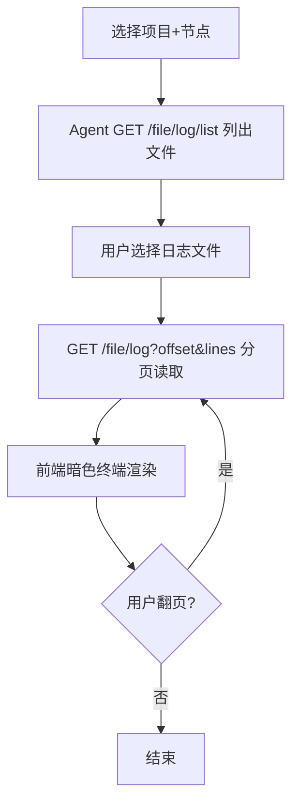
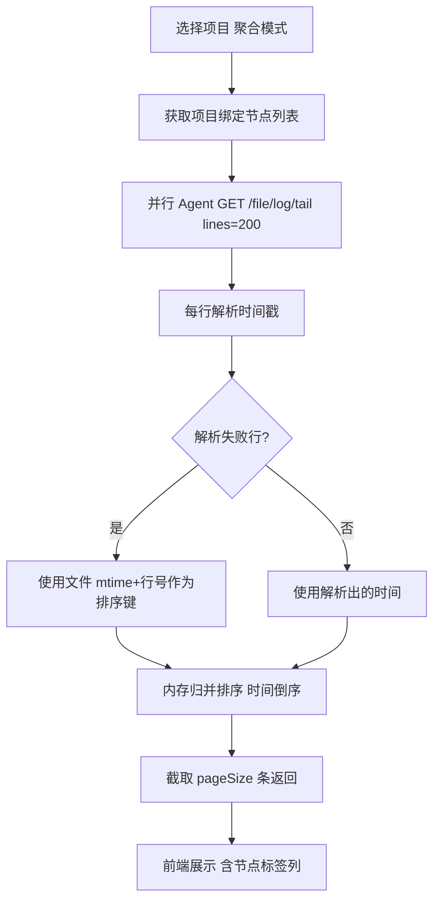
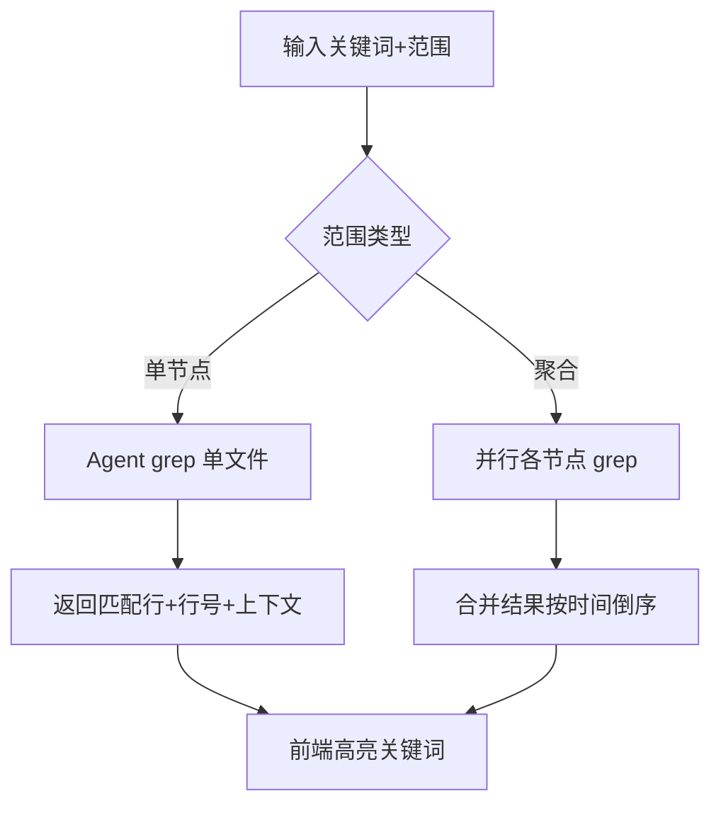
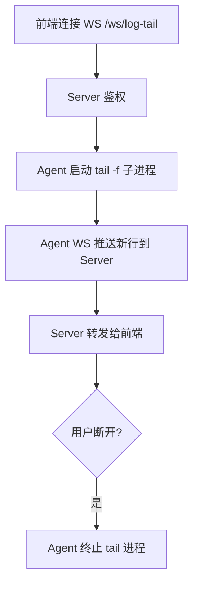

# 详细设计文档 v1.0 - 日志管理

## 1. 模块概述

日志管理模块替代现有简陋的「日志查看」页面，在不引入 ELK/Loki 等中间件的前提下，通过 Server 编排、Agent 本地读取，实现**单节点日志查看**、**同应用多节点日志聚合**（按时间倒序）、**关键词搜索**（单节点与聚合范围）。支持历史分页浏览与 WebSocket 实时 tail，满足内网老微服务运维排障需求。

---

## 2. 系统架构

```
┌────────────────────────────────────────────────────────────────────┐
│  LogManageView.vue                                                  │
│  ┌──────────┐ ┌──────────┐ ┌──────────┐ ┌──────────────────────┐  │
│  │ 单节点   │ │ 聚合视图 │ │ 搜索框   │ │ 实时 Tail (WebSocket)│  │
│  └────┬─────┘ └────┬─────┘ └────┬─────┘ └──────────┬───────────┘  │
└───────┼────────────┼────────────┼────────────────────┼──────────────┘
        │            │            │                    │
        ▼            ▼            ▼                    ▼
┌────────────────────────────────────────────────────────────────────┐
│  Server                                                             │
│  LogController ──→ LogAggregateService ──→ LogSearchService        │
│       │                    │                      │                 │
│       │           TimestampParser (项目级正则)    │                 │
│       │           MergeSortEngine (内存归并)       │                 │
│       └────────────────────┴──────────────────────┘                 │
│                            │                                        │
│              AgentProxyController / LogTailHandler (WS)             │
└────────────────────────────┬───────────────────────────────────────┘
                             │ HTTP + WebSocket
┌────────────────────────────▼───────────────────────────────────────┐
│  Agent                                                              │
│  GET  /file/log          — 分页读取                                 │
│  GET  /file/log/tail     — 读取文件尾部 N 行                        │
│  POST /file/log/search   — grep 搜索                                │
│  GET  /file/log/list     — 列出日志目录文件                          │
│  WS   → Server LogTailHandler — 实时推送新增行                       │
└────────────────────────────────────────────────────────────────────┘
                             │
                             ▼
              /home/stms/tm-server/logs/*.log
```

---

## 3. 数据库设计

### 3.1 表：project_log_profile（项目日志配置）

| 字段名 | 类型 | 长度 | 必填 | 主键 | 说明 |
|--------|------|------|------|------|------|
| id | BIGINT | — | 是 | PK | 自增 |
| project_id | BIGINT | — | 是 | — | 项目 ID，唯一 |
| log_dir | VARCHAR | 500 | 是 | — | 日志目录，如 logs/ |
| main_log_file | VARCHAR | 500 | 是 | — | 主日志相对路径 |
| rolling_pattern | VARCHAR | 200 | 否 | — | 滚动日志 glob，如 `*.log` |
| timestamp_regex | VARCHAR | 500 | 是 | — | 行首时间戳正则 |
| timestamp_format | VARCHAR | 100 | 是 | — | SimpleDateFormat 格式 |
| max_line_length | INT | — | 否 | — | 单行最大长度，默认 4096 |
| create_time | BIGINT | — | 是 | — | 创建时间 |
| update_time | BIGINT | — | 是 | — | 更新时间 |

**索引设计：**
- PRIMARY KEY (id)
- UNIQUE INDEX uk_project (project_id)

### 3.2 表：log_search_task（异步搜索任务，可选）

| 字段名 | 类型 | 长度 | 必填 | 主键 | 说明 |
|--------|------|------|------|------|------|
| id | BIGINT | — | 是 | PK | 自增 |
| project_id | BIGINT | — | 是 | — | 项目 ID |
| keyword | VARCHAR | 500 | 是 | — | 搜索关键词 |
| scope | VARCHAR | 20 | 是 | — | SINGLE / AGGREGATE |
| node_ids | VARCHAR | 2000 | 否 | — | 搜索范围节点 |
| status | TINYINT | — | 是 | — | 0=进行中 1=完成 2=失败 |
| result_count | INT | — | 否 | — | 命中行数 |
| result_preview | TEXT | — | 否 | — | 前 100 条 JSON |
| expire_time | BIGINT | — | 是 | — | 结果 TTL |
| create_time | BIGINT | — | 是 | — | 创建时间 |

**索引设计：**
- PRIMARY KEY (id)
- INDEX idx_project_time (project_id, create_time)

---

## 4. 核心流程设计

### 4.1 单节点日志查看



### 4.2 多节点日志聚合



### 4.3 关键词搜索



### 4.4 实时 Tail



---

## 5. API 接口设计

| 接口路径 | 方法 | 说明 | 权限 |
|----------|------|------|------|
| `/logs/profile` | GET | 获取项目日志配置 | operator+ |
| `/logs/profile` | POST | 保存项目日志配置 | admin |
| `/logs/files` | GET | 列出节点日志文件 | operator+ |
| `/logs/view` | GET | 单节点分页查看 | operator+ |
| `/logs/aggregate` | GET | 多节点聚合日志 | operator+ |
| `/logs/search` | POST | 关键词搜索 | operator+ |
| `/logs/search/{taskId}` | GET | 查询异步搜索任务结果 | operator+ |

### 5.1 GET /api/logs/aggregate

**请求参数：**
```
projectId=1&page=1&pageSize=100&since=1750000000000
```

**响应：**
```json
{
  "code": 0,
  "data": {
    "total": 350,
    "page": 1,
    "pageSize": 100,
    "lines": [
      {
        "nodeId": 11,
        "nodeName": "tm-node-2",
        "timestamp": 1750000123456,
        "timestampText": "2025-06-25 10:30:00.123",
        "lineNo": 8842,
        "content": "2025-06-25 10:30:00.123 ERROR [main] o.s.boot - Connection refused",
        "sourceFile": "app.log"
      },
      {
        "nodeId": 10,
        "nodeName": "tm-node-1",
        "timestamp": 1750000123400,
        "lineNo": 12001,
        "content": "2025-06-25 10:30:00.100 WARN  [pool-1] ..."
      }
    ]
  }
}
```

### 5.2 POST /api/logs/search

**请求：**
```json
{
  "projectId": 1,
  "keyword": "NullPointerException",
  "scope": "AGGREGATE",
  "nodeIds": [10, 11, 12],
  "contextLines": 3,
  "maxResults": 200
}
```

**响应：**
```json
{
  "code": 0,
  "data": {
    "keyword": "NullPointerException",
    "totalHits": 15,
    "hits": [
      {
        "nodeId": 10,
        "nodeName": "tm-node-1",
        "file": "/home/stms/tm-server/logs/app.log",
        "lineNo": 5021,
        "timestamp": 1750000000000,
        "matchedLine": "... NullPointerException at com.example.Service.run",
        "contextBefore": ["...", "..."],
        "contextAfter": ["...", "..."]
      }
    ]
  }
}
```

### 5.3 Agent 扩展接口

**GET /api/file/log/tail**
```
?logPath=/home/stms/tm-server/logs/app.log&lines=200
```

**POST /api/file/log/search**
```json
{
  "logPath": "/home/stms/tm-server/logs/app.log",
  "keyword": "ERROR",
  "maxResults": 100,
  "contextLines": 2,
  "timeoutSec": 30
}
```

**实现：** Agent 执行 `grep -n -C {context} "{keyword}" {logPath} | head -n {max}`

---

## 6. 关键技术点

- **无中间件聚合**：Server 内存归并，单次请求节点数 ≤ 20，每节点 tail ≤ 200 行，防止 OOM
- **时间戳解析**：`java.util.regex.Pattern` + `SimpleDateFormat`（JDK 8），解析失败降级为文件修改时间
- **大文件策略**：禁止 Server 拉取全文件；搜索在 Agent 端 `grep` 完成
- **WebSocket Tail**：Agent `tail -f` 子进程，断连时 `destroy()` 防僵尸进程
- **缓存**：聚合结果可选 Redis-less 本地 `ConcurrentHashMap`，TTL 60s（相同参数重复请求）
- **日志脱敏**：搜索/展示前过滤 `password=`、`token=` 等模式（正则替换为 `***`）
- **修复现有 Bug**：Server `FileController.viewLog` 当前读 Server 本地文件，改为代理 Agent

---

## 7. 异常处理

| 异常场景 | 处理方式 | 返回码 |
|----------|----------|--------|
| 日志文件不存在 | 跳过该节点，聚合结果标注 | 200（部分空） |
| grep 超时（>30s） | 终止进程，返回已完成部分 | 200 + warning |
| 时间戳无法解析 | 降级排序，标注「时间未识别」 | 200 |
| 节点离线 | 聚合结果中排除并提示 | 200 |
| 关键词为空 | 参数校验拒绝 | 1001 |
| 单行超长 | 截断至 max_line_length | 200 |
| Tail 连接数过多 | 限制每节点最多 5 个 tail 会话 | 1009 |

---

## 8. 测试要点

1. 单节点分页：offset/lines 翻页正确，不重复不丢行
2. 三节点聚合：时间倒序正确，每行显示来源节点
3. 节点日志时间格式不一致：降级排序不崩溃
4. 搜索 `ERROR`：单节点与聚合模式均能返回且高亮
5. 搜索大文件（100MB+）：30s 内返回或超时提示
6. 实时 tail：新写入日志 2s 内前端可见
7. 断开 tail：Agent 无残留 tail 进程（`ps aux | grep tail`）
8. 离线节点聚合：不影响其他节点结果
9. 生产路径 `/home/stms/tm-server/logs/` 可正常列出 app.log
10. 原 `/logs` 路由重定向至 `/log-manage` 可用

---

## 9. 前端页面设计要点

**LogManageView.vue** Tab 结构：

| Tab | 功能 |
|-----|------|
| 单节点查看 | 节点选择 + 文件列表 + 分页日志 + Tail 按钮 |
| 聚合查看 | 项目选择 + 时间范围 + 聚合日志表格（节点/时间/内容列） |
| 日志搜索 | 关键词 + 范围切换 + 结果列表 + 上下文展开 |

UI 沿用暗色终端风格（与现 FileLogView 一致），增加虚拟滚动（`vue-virtual-scroller`）优化大列表渲染。
