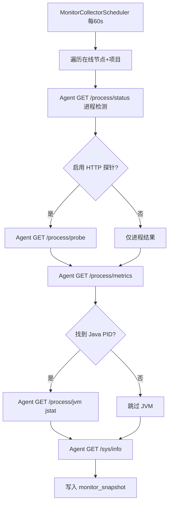
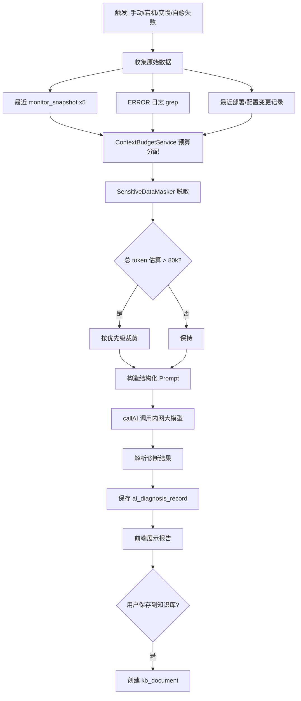
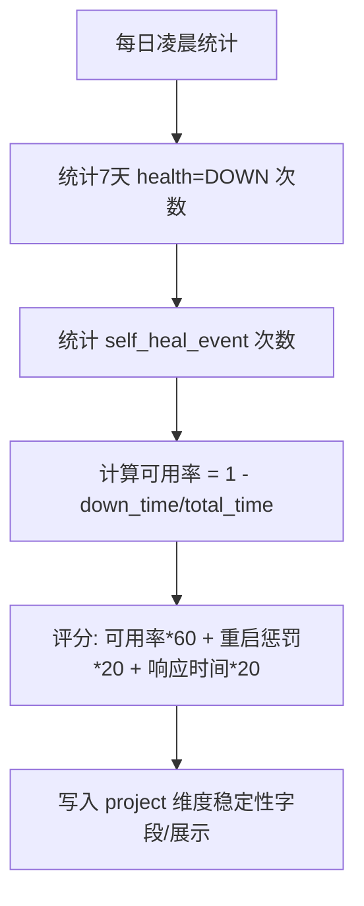

# 详细设计文档 v1.0 - 监控增强与 AI 诊断

## 1. 模块概述

监控增强模块在现有节点级 CPU/内存/磁盘采集基础上，扩展**应用级健康状态、进程资源、可选 JVM 指标、进程稳定性**等多维指标。老微服务**无 Actuator、不可改代码**，健康状态由 Agent **进程检测 + 可配置 HTTP 探针（GET/POST）** 判定。当应用宕机或响应变慢时，结合监控快照与日志，通过智能截取送入 AI 诊断，并可保存至知识库。

---

## 2. 系统架构

```
┌─────────────────────────────────────────────────────────────────────┐
│  AppMonitorView.vue / 增强 DashboardView.vue                         │
│  ┌────────────┐ ┌────────────┐ ┌────────────┐ ┌──────────────────┐  │
│  │ 健康状态   │ │ 资源图表   │ │ JVM 面板   │ │ AI 诊断报告      │  │
│  └─────┬──────┘ └─────┬──────┘ └─────┬──────┘ └────────┬─────────┘  │
└────────┼──────────────┼──────────────┼───────────────────┼────────────┘
         │              │              │                   │
         ▼              ▼              ▼                   ▼
┌─────────────────────────────────────────────────────────────────────┐
│  Server                                                              │
│  MonitorController ──→ MonitorCollectorService (定时采集)            │
│         │                    │                                       │
│         │                    ▼                                       │
│         │            monitor_snapshot (H2 时序)                      │
│         │                                                            │
│  AIDiagnosisController ──→ ContextBudgetService (智能截取)           │
│         │                    │                                       │
│         │                    ├── LogSnippetExtractor                 │
│         │                    ├── MetricSnapshotBuilder               │
│         │                    └── SensitiveDataMasker                 │
│         │                    │                                       │
│         └────────────────────┴──→ AIAnalyzeController.callAI()       │
└────────────────────────────┬────────────────────────────────────────┘
                             │ HTTP
┌────────────────────────────▼────────────────────────────────────────┐
│  Agent                                                               │
│  GET /process/status    — 进程存活（ps 匹配 deploy_dir+jar）          │
│  GET /process/probe     — HTTP 健康探针 GET/POST/HEAD（新增）          │
│  GET /process/metrics   — 进程 CPU/内存（ps/top，新增）                 │
│  GET /process/jvm       — jstat（基于 ps 找到的 Java PID，可选）      │
│  GET /sys/info          — 主机 CPU/内存/磁盘（已有）                  │
└─────────────────────────────────────────────────────────────────────┘
```

---

## 3. 数据库设计

### 3.1 表：monitor_snapshot（监控快照）

| 字段名 | 类型 | 长度 | 必填 | 主键 | 说明 |
|--------|------|------|------|------|------|
| id | BIGINT | — | 是 | PK | 自增 |
| project_id | BIGINT | — | 是 | — | 项目 ID |
| node_id | BIGINT | — | 是 | — | 节点 ID |
| health_status | VARCHAR | 20 | 是 | — | UP/DOWN/DEGRADED/UNKNOWN |
| health_detail | VARCHAR | 500 | 否 | — | 健康检查详情 |
| process_status | VARCHAR | 20 | 是 | — | RUNNING/STOPPED/ZOMBIE |
| process_pid | INT | — | 否 | — | 进程 PID |
| cpu_percent | DECIMAL | 5,2 | 否 | — | 应用进程 CPU% |
| memory_mb | INT | — | 否 | — | 应用进程内存 MB |
| heap_used_mb | INT | — | 否 | — | JVM 堆已用 MB |
| heap_max_mb | INT | — | 否 | — | JVM 堆最大 MB |
| gc_count | INT | — | 否 | — | Young GC 次数（周期内增量） |
| gc_time_ms | INT | — | 否 | — | GC 耗时 ms |
| response_ms | INT | — | 否 | — | 健康检查响应时间 |
| host_cpu_percent | DECIMAL | 5,2 | 否 | — | 主机 CPU |
| host_memory_percent | INT | — | 否 | — | 主机内存% |
| disk_usage_percent | INT | — | 否 | — | 部署目录所在磁盘% |
| extra_json | TEXT | — | 否 | — | 扩展指标 JSON |
| collect_time | BIGINT | — | 是 | — | 采集时间 |

**索引设计：**
- PRIMARY KEY (id)
- INDEX idx_project_node_time (project_id, node_id, collect_time)
- INDEX idx_collect_time (collect_time)

**数据保留：** 定时任务删除 30 天前数据。

### 3.2 表：ai_diagnosis_record（AI 诊断记录）

| 字段名 | 类型 | 长度 | 必填 | 主键 | 说明 |
|--------|------|------|------|------|------|
| id | BIGINT | — | 是 | PK | 自增 |
| project_id | BIGINT | — | 是 | — | 项目 ID |
| node_id | BIGINT | — | 否 | — | 节点 ID，聚合诊断可为空 |
| trigger_type | VARCHAR | 30 | 是 | — | MANUAL/DOWN/SLOW/SELF_HEAL_FAIL |
| question | TEXT | — | 否 | — | 用户提问 |
| context_summary | TEXT | — | 是 | — | 送入 AI 的截取摘要 |
| diagnosis | TEXT | — | 是 | — | AI 诊断结果 |
| severity | VARCHAR | 20 | 否 | — | CRITICAL/WARNING/INFO |
| saved_to_kb | TINYINT | — | 否 | — | 是否已存知识库 |
| kb_document_id | BIGINT | — | 否 | — | 关联知识库文档 |
| operator_id | BIGINT | — | 否 | — | 触发用户 |
| token_used | INT | — | 否 | — | 估算 token 用量 |
| create_time | BIGINT | — | 是 | — | 创建时间 |

**索引设计：**
- PRIMARY KEY (id)
- INDEX idx_project_time (project_id, create_time)

### 3.3 表：project_health_probe（HTTP 健康探针，每项目一条）

| 字段名 | 类型 | 长度 | 必填 | 主键 | 说明 |
|--------|------|------|------|------|------|
| id | BIGINT | — | 是 | PK | 自增 |
| project_id | BIGINT | — | 是 | — | 项目 ID，唯一 |
| enabled | TINYINT | — | 是 | — | 是否启用 HTTP 探针，默认 1 |
| method | VARCHAR | 10 | 是 | — | GET / POST / HEAD |
| url | VARCHAR | 500 | 是 | — | 探测 URL，如 `http://127.0.0.1:8080/hello` |
| headers | TEXT | — | 否 | — | JSON，请求头 |
| body | TEXT | — | 否 | — | POST 请求体 |
| expected_status | INT | — | 是 | — | 期望 HTTP 状态码，默认 200 |
| body_contains | VARCHAR | 500 | 否 | — | 响应体需包含的关键字（空=不校验） |
| timeout_ms | INT | — | 是 | — | 超时毫秒，默认 3000 |
| create_time | BIGINT | — | 是 | — | 创建时间 |
| update_time | BIGINT | — | 是 | — | 更新时间 |

**索引设计：**
- PRIMARY KEY (id)
- UNIQUE INDEX uk_project (project_id)

### 3.4 project_info 扩展字段

| 字段名 | 类型 | 说明 |
|--------|------|------|
| monitor_interval_sec | INT | 采集间隔，默认 60 |

---

## 4. 核心流程设计

### 4.1 定时监控采集



### 4.2 AI 智能诊断流程



### 4.3 稳定性评分计算



---

## 5. API 接口设计

| 接口路径 | 方法 | 说明 | 权限 |
|----------|------|------|------|
| `/monitor/app/overview` | GET | 项目应用监控总览 | operator+ |
| `/monitor/app/node` | GET | 单节点详细指标 | operator+ |
| `/monitor/app/history` | GET | 指标历史曲线数据 | operator+ |
| `/monitor/health-probe` | GET/POST | 项目 HTTP 探针配置 | admin |
| `/monitor/app/stability` | GET | 7天稳定性评分 | operator+ |
| `/ai/diagnose` | POST | 触发 AI 诊断 | operator+ |
| `/ai/diagnose/{id}` | GET | 获取诊断报告 | operator+ |
| `/ai/diagnose/{id}/save-kb` | POST | 诊断结果保存到知识库 | operator+ |

### 5.1 GET /api/monitor/app/overview

**请求：** `projectId=1`

**响应：**
```json
{
  "code": 0,
  "data": {
    "projectId": 1,
    "projectName": "tm-server",
    "summary": {
      "totalNodes": 3,
      "upCount": 2,
      "downCount": 1,
      "degradedCount": 0,
      "avgResponseMs": 45,
      "stabilityScore": 87
    },
    "nodes": [
      {
        "nodeId": 10,
        "nodeName": "tm-node-1",
        "healthStatus": "UP",
        "processStatus": "RUNNING",
        "cpuPercent": 12.5,
        "memoryMb": 512,
        "heapUsedMb": 256,
        "heapMaxMb": 1024,
        "hostCpuPercent": 35.2,
        "hostMemoryPercent": 68,
        "diskUsagePercent": 72,
        "responseMs": 32,
        "collectTime": 1750000000000
      },
      {
        "nodeId": 11,
        "healthStatus": "DOWN",
        "processStatus": "STOPPED",
        "lastError": "Connection refused on health check"
      }
    ]
  }
}
```

### 5.2 POST /api/ai/diagnose

**请求：**
```json
{
  "projectId": 1,
  "nodeId": 11,
  "triggerType": "DOWN",
  "question": "应用为什么挂掉了？请给出修复建议"
}
```

**响应：**
```json
{
  "code": 0,
  "data": {
    "id": 501,
    "severity": "CRITICAL",
    "diagnosis": "## 根因分析\n应用进程已停止，健康检查连接被拒绝...\n\n## 影响范围\ntm-node-2 单节点不可用...\n\n## 修复建议\n1. 检查 logs/app.log 中 OOM 关键字...\n2. 调整 -Xmx 参数...",
    "contextSummary": {
      "monitorSnapshots": 5,
      "errorLogLines": 42,
      "tokenEstimated": 28500
    },
    "savedToKb": false
  }
}
```

### 5.3 POST /api/monitor/health-probe

**请求：**
```json
{
  "projectId": 1,
  "enabled": true,
  "method": "GET",
  "url": "http://127.0.0.1:8080/hello",
  "headers": {},
  "body": "",
  "expectedStatus": 200,
  "bodyContains": "ok",
  "timeoutMs": 3000
}
```

### 5.4 Agent 新增接口

**GET /api/process/status** — 进程存活（必调）
```
?deployDir=/home/stms/tm-server&jarName=tm.jar
```
响应：`{ "alive": true, "pid": 12345, "checkMethod": "PS_GREP" }`

实现：`ps aux | grep {deployDir} | grep {jarName} | grep -v grep`

**GET /api/process/probe** — HTTP 健康探针
```
?method=GET&url=http://127.0.0.1:8080/hello&expectedStatus=200&timeoutMs=3000
```
POST 时改 POST body 传 `method=POST&url=...&body=...&headers=...`

响应：`{ "status": "UP", "httpCode": 200, "responseMs": 32, "bodySnippet": "ok" }`

实现：Agent 使用 `HttpURLConnection`（JDK 8），支持 GET/POST/HEAD，不依赖 Actuator。

**GET /api/process/jvm** — 可选，需 L1 返回 pid
```
?pid=12345
```
响应：`{ "heapUsedMb": 256, "heapMaxMb": 1024, "gcYoungCount": 120, "gcTimeMs": 3500 }`

实现：`jstat -gc {pid}`（同用户权限下执行；失败则返回空，不阻断监控）

---

## 6. 关键技术点

### 6.1 智能截取算法（128k 上下文）

```java
// 伪代码 — JDK 8
public class ContextBudgetService {
    static final int MAX_INPUT_TOKENS = 80000; // 预留 48k 给输出

    public String buildContext(DiagnosisRequest req) {
        StringBuilder ctx = new StringBuilder();
        // 优先级 1: 结构化监控 JSON (≤8k tokens)
        ctx.append(buildMetricJson(req));
        // 优先级 2: ERROR/Exception 日志行 + 上下各5行 (≤50k)
        ctx.append(extractErrorLogs(req, 50000));
        // 优先级 3: 最近变更 (≤10k)
        ctx.append(buildChangeLog(req, 10000));
        // Token 估算: len/2 中文友好近似
        while (estimateTokens(ctx) > MAX_INPUT_TOKENS) {
            trimLowestPriority(ctx);
        }
        return maskSensitive(ctx.toString());
    }
}
```

**日志截取规则：**
1. `grep -E "ERROR|Exception|FATAL|OOM"` 取最近 200 条
2. 每条附加前后 5 行上下文
3. 同一异常栈保留完整栈，不截断栈中间
4. 重复异常（相同 message）去重，保留最新 3 次

### 6.2 JVM 采集（零侵入）

老微服务无 Actuator，**不要求改代码**：

1. L1 `ps` 找到 Java 进程 PID
2. 对 PID 执行 `jstat -gc` 获取堆/GC（Agent 与进程同用户时可用）
3. 无法执行 jstat 时：仅展示进程 CPU/内存（`ps -o %cpu,rss`）和主机资源

### 6.3 JDK 8 兼容

- 时间使用 `java.util.Date` + `SimpleDateFormat`
- HTTP 使用现有 `RestTemplate`
- JSON 使用 `Jackson` / `Fastjson2`（与项目一致）

### 6.4 运维友好展示

- 指标卡片使用**交通灯颜色**（绿/黄/红）+ 中文标签，不展示原始 JVM 参数名
- AI 诊断结果结构化：根因 / 影响 / 建议 / 预防措施
- 「看不懂」时一键「保存到知识库」供开发查阅

---

## 7. 异常处理

| 异常场景 | 处理方式 | 返回码 |
|----------|----------|--------|
| HTTP 探针连接失败 | 标记 DEGRADED/DOWN，记录 responseMs | 200 |
| 未配置 HTTP 探针 | 仅依 L1 进程判断 RUNNING/DOWN | 200 |
| jstat 无权限 | 跳过 JVM 指标，标注「JVM 不可用」 | 200 |
| AI 服务未配置 | 返回配置指引 | 200（diagnosis 为提示文本） |
| AI 调用超时 | 重试 1 次，失败返回已截取上下文供人工分析 | 500 |
| 日志读取失败 | 诊断仅基于监控数据 | 200 + warning |
| 监控数据为空 | 提示「尚无采集数据，请等待下一周期」 | 200 |

---

## 8. 测试要点

1. 进程 kill 后：L1 判定 DOWN，无需 HTTP 探针
2. 进程在但 `/hello` 返回 500：L2 判定 DEGRADED
3. GET 探针 `expected_status=200` 通过即 UP
4. POST 探针带 body，老接口可配 `method=POST&body=...`
5. 无 Java PID 时 JVM 面板显示「暂无数据」，不报错
4. AI 诊断：10MB 日志文件仅截取 ERROR 相关行，token 估算 < 80k
5. 敏感信息（数据库密码）在送入 AI 前被脱敏
6. 稳定性评分：7 天内 3 次 DOWN 分数明显下降
7. 诊断报告保存知识库后 `kb_document` 可查看
8. Dashboard 增强：节点/项目维度切换正确
9. 响应慢判定：health_check responseMs > 阈值标记 DEGRADED
10. 自愈失败触发自动 AI 诊断（M5 联动）

---

## 9. 前端页面设计要点

**AppMonitorView.vue**（路由 `/app-monitor`）：

| 区块 | 内容 |
|------|------|
| 顶部 | 项目选择 + 稳定性评分徽章 + 「AI 诊断」按钮 |
| 左栏 | 节点列表（健康状态圆点） |
| 主区 | ECharts 折线（CPU/内存/堆/GC/响应时间） |
| 底部 | 最近 AI 诊断报告列表 |

**DashboardView 增强**：节点状态图改为真实数据；增加「异常应用」快捷入口。
