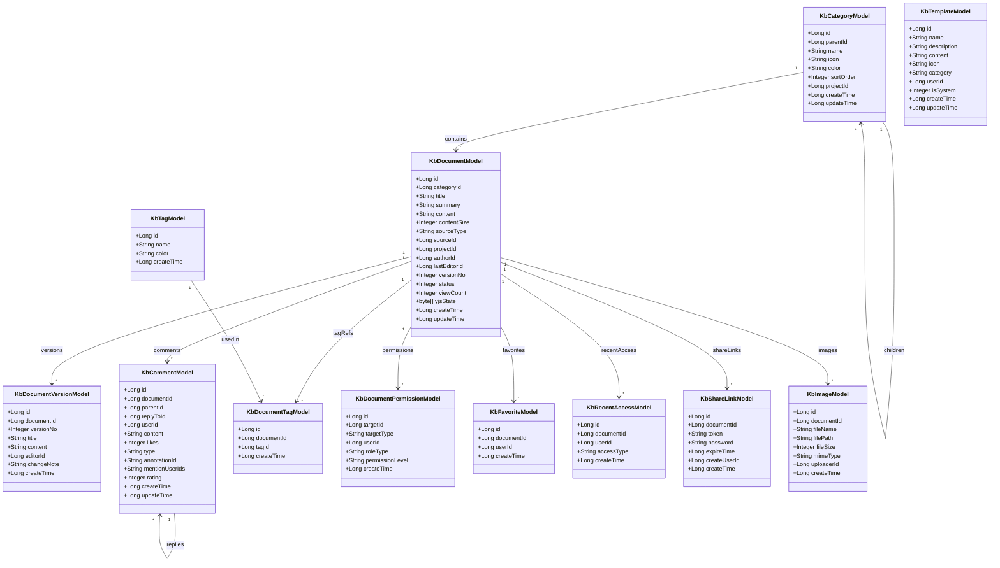
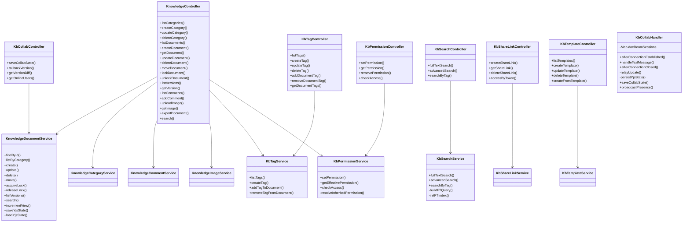
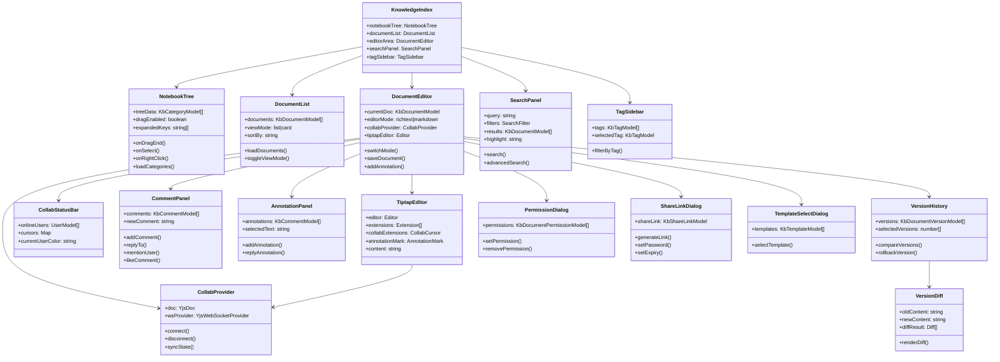
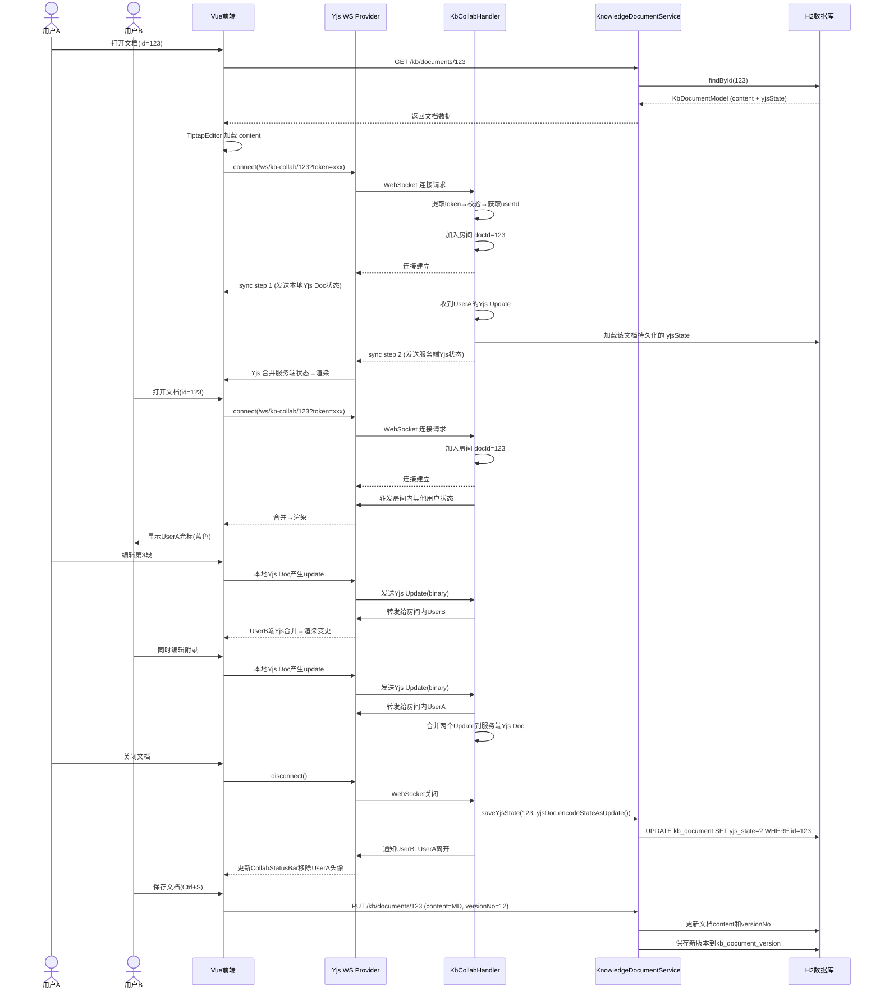
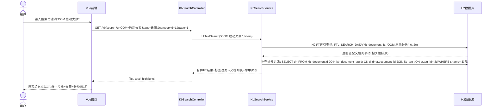
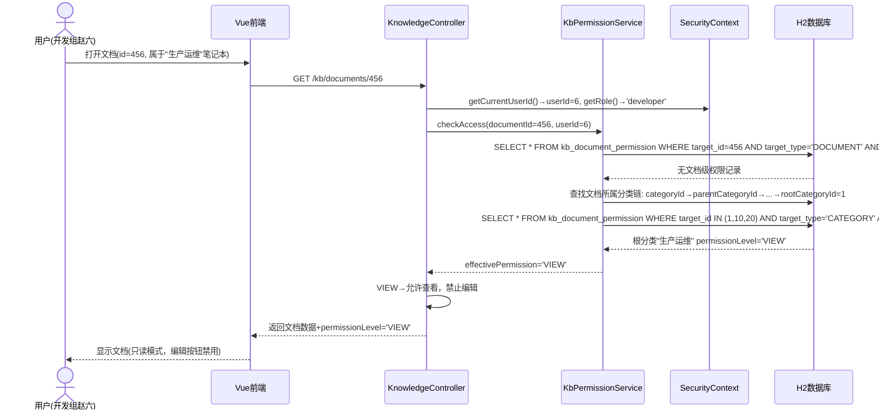
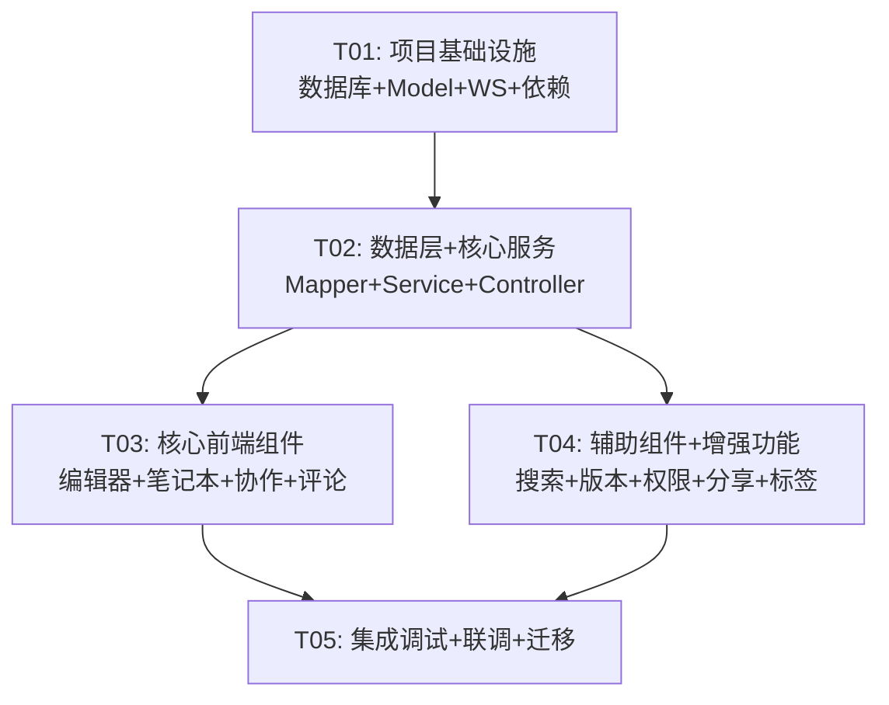

# 知识管理模块重新设计 — 系统架构设计

> **版本**：v2.0
> **作者**：高见远（架构师）
> **日期**：2026-06-27
> **基于**：许清楚 PRD v2.0
> **技术栈**：Vue 3 + Ant Design Vue + TypeScript | Spring Boot 2.7.18 + H2 + MyBatis

---

## Part A：系统设计

### 1. 实现方案与框架选型

#### 1.1 核心技术挑战

| 挑战 | 分析 | 方案 |
|------|------|------|
| **富文本+MD双模式无缝切换** | ProseMirror DOM 与 Markdown 之间的实时转换需兼顾保真度和性能 | Tiptap（ProseMirror上层封装）+ tiptap-markdown 扩展，DOM↔MD 双向转换 |
| **CRDT 实时协作** | 多人同段落编辑需无冲突自动合并；H2 不支持分布式锁 | Yjs CRDT 算法 + y-websocket provider，服务端仅做消息转发和持久化 |
| **H2 全文索引替代 LIKE** | H2 2.2.224 支持 FT 索引但需手动建索引和查询语法适配 | 使用 H2 FT 索引（`CREATE ALIAS FTL_QUERY`），P0 先实现，P1 预留 Lucene 接口 |
| **WebSocket 协作持久化** | Yjs Doc 状态需要持久化到数据库，断线重连需恢复 | 服务端在 WebSocket 断连时将最终 Yjs Doc 编码（Update）写入 `kb_document.yjs_state` 字段 |
| **权限继承** | 笔记本级权限需继承到子分类和文档，文档级可覆盖 | 递归查询分类链 + 文档级覆盖表 `kb_document_permission`，权限优先级：文档级 > 最近分类级 > 根分类级 |
| **版本 Diff 对比** | Markdown 内容的 diff 需可视化（红绿标注） | 前端 diff-match-patch 库逐行对比，渲染为 Tiptap 文档的红绿标注节点 |
| **内联批注** | 富文本中选中文字添加批注需标记范围+右侧浮动 | Tiptap Annotation 扩展（自定义 Mark），选中文字加 `annotation-id` 属性，右侧面板按 id 展示批注 |
| **数据迁移兼容** | 现有 kb_* 表 ALTER 新增字段，需兼容已有数据 | 所有新增字段设默认值，`status` 默认 1（已发布），`icon` 默认空，保证旧数据正常查询 |

#### 1.2 框架选型与理由

| 层 | 选型 | 版本 | 理由 |
|---|------|------|------|
| **富文本引擎** | Tiptap | ^2.6 | 基于 ProseMirror，Vue 3 官方适配；原生支持 Yjs Collaboration 扩展；扩展机制丰富（Mark/Node/Extension） |
| **Markdown 模式** | Tiptap + tiptap-markdown | — | 统一底层为 ProseMirror，避免引入第二个编辑器；MD 模式用 Tiptap 的 CodeBlock 低层 + 实时预览面板 |
| **CRDT 协作** | Yjs + y-websocket | ^13.5 / ^1.5 | 业界最成熟 CRDT 库；y-websocket 是官方 provider；Tiptap 有 `@tiptap/extension-collaboration` 直接集成 |
| **拖拽排序** | vuedraggable | ^4.1 | Vue 3 兼容的 SortableJS 封装，树形拖拽通过 nested 选项支持 |
| **Diff 对比** | diff-match-patch | ^1.0 | Google 开源 diff 库，纯文本逐行/逐字符对比，配合 Tiptap 渲染 |
| **全文搜索** | H2 FT 索引 | 内置 | H2 2.2.224 原生支持 FTL_QUERY 全文索引，无额外依赖；P1 预留升级 Lucene 接口 |
| **PDF 导出** | html2pdf.js | ^0.10 | 前端纯 JS 生成 PDF，不引入后端渲染依赖，适合内网场景 |
| **图标库** | Lucide Icons | ^0.400 | 轻量 SVG 图标库，与 Ant Design Vue 互补，提供 ≥20 运维场景图标 |
| **WebSocket 后端** | Spring TextWebSocketHandler | 已有 | 项目已有 ConsoleHandler/DeployHandler/MonitorHandler 的成熟模式，新增 KbCollabHandler 风格一致 |
| **数据访问** | MyBatis + Mapper XML | 已有 | 项目统一使用 MyBatis，新增表直接加 Mapper XML |
| **前端构建** | Vite 5.2 | 已有 | 项目统一构建工具 |
| **UI 组件** | Ant Design Vue 4.2.6 | 已有 | 项目统一 UI 库，不引入 MUI/Tailwind |

#### 1.3 架构模式

采用 **前后端分离 + WebSocket 实时通道** 模式：

```
┌──────────────────────────────────────────────────────────────────┐
│  Vue 3 SPA (前端)                                                │
│  ┌──────────┐  ┌──────────┐  ┌──────────┐  ┌──────────────────┐ │
│  │ 笔记本树  │  │ 文档列表  │  │ Tiptap   │  │ Yjs WS Provider │ │
│  │ 拖拽排序  │  │ 搜索筛选  │  │ 编辑器    │  │ 实时协作         │ │
│  └──────────┘  └──────────┘  └──────────┘  └──────────────────┘ │
│         │            │            │              │               │
│    REST API     REST API     REST API     WebSocket              │
│         │            │            │              │               │
├─────────┼────────────┼────────────┼──────────────┼───────────────┤
│  Spring Boot (后端)                                              │
│  ┌───────────────────────────────────────────────────────────┐   │
│  │ KnowledgeController (REST CRUD)                           │   │
│  │ KbCollabHandler (WebSocket Yjs转发)                       │   │
│  │ KbSearchController (全文搜索)                              │   │
│  │ KbPermissionService (权限校验)                             │   │
│  └───────────────────────────────────────────────────────────┘   │
│         │                                                       │
│  ┌───────────────────────────────────────────────────────────┐   │
│  │ MyBatis Mapper → H2 数据库                                │   │
│  │ kb_category / kb_document / kb_document_version           │   │
│  │ kb_comment / kb_tag / kb_document_tag                     │   │
│  │ kb_document_permission / kb_template                      │   │
│  │ kb_favorite / kb_recent_access / kb_image                 │   │
│  │ kb_share_link                                             │   │
│  └───────────────────────────────────────────────────────────┘   │
└──────────────────────────────────────────────────────────────────┘
```

**关键设计决策**：

1. **Yjs CRDT 服务端仅做转发和持久化**：不实现 OT 算法，服务端不解析 Yjs Update 内容，只做 binary store & relay，保持简单可靠
2. **文档内容存储为 Markdown**：`kb_document.content` 存储 MD 字符串（保持兼容），新增 `kb_document.yjs_state` 存储 Yjs 二进制状态用于协作恢复
3. **锁机制保留作为 fallback**：`kb_document_lock` 表保留，当 CRDT WS 断连时降级为锁模式
4. **搜索索引服务独立**：新增 `KbSearchService` 封装 H2 FT 索引逻辑，P1 预留 `SearchIndexService` 接口可替换为 Lucene

---

### 2. 文件列表

#### 2.1 后端 — 新增文件

| 相对路径 | 说明 |
|----------|------|
| `backend/common/src/main/java/com/ops/common/model/KbTagModel.java` | 标签 Model |
| `backend/common/src/main/java/com/ops/common/model/KbDocumentTagModel.java` | 文档-标签关联 Model |
| `backend/common/src/main/java/com/ops/common/model/KbDocumentPermissionModel.java` | 文档权限 Model |
| `backend/common/src/main/java/com/ops/common/model/KbTemplateModel.java` | 模板 Model |
| `backend/common/src/main/java/com/ops/common/model/KbFavoriteModel.java` | 收藏 Model |
| `backend/common/src/main/java/com/ops/common/model/KbRecentAccessModel.java` | 最近访问 Model |
| `backend/common/src/main/java/com/ops/common/model/KbShareLinkModel.java` | 外链分享 Model |
| `backend/server/src/main/java/com/ops/server/knowledge/service/KbSearchService.java` | 全文搜索服务 |
| `backend/server/src/main/java/com/ops/server/knowledge/service/KbPermissionService.java` | 权限服务 |
| `backend/server/src/main/java/com/ops/server/knowledge/service/KbTagService.java` | 标签服务 |
| `backend/server/src/main/java/com/ops/server/knowledge/service/KbTemplateService.java` | 模板服务 |
| `backend/server/src/main/java/com/ops/server/knowledge/service/KbFavoriteService.java` | 收藏服务 |
| `backend/server/src/main/java/com/ops/server/knowledge/service/KbRecentAccessService.java` | 最近访问服务 |
| `backend/server/src/main/java/com/ops/server/knowledge/service/KbShareLinkService.java` | 外链分享服务 |
| `backend/server/src/main/java/com/ops/server/knowledge/controller/KbSearchController.java` | 搜索 REST 接口 |
| `backend/server/src/main/java/com/ops/server/knowledge/controller/KbTagController.java` | 标签 REST 接口 |
| `backend/server/src/main/java/com/ops/server/knowledge/controller/KbTemplateController.java` | 模板 REST 接口 |
| `backend/server/src/main/java/com/ops/server/knowledge/controller/KbPermissionController.java` | 权限 REST 接口 |
| `backend/server/src/main/java/com/ops/server/knowledge/controller/KbShareLinkController.java` | 分享 REST 接口 |
| `backend/server/src/main/java/com/ops/server/knowledge/controller/KbCollabController.java` | 协作 REST 接口（版本保存/回滚） |
| `backend/server/src/main/java/com/ops/server/websocket/KbCollabHandler.java` | Yjs WebSocket 协作 Handler |
| `backend/server/src/main/java/com/ops/server/mapper/KbTagMapper.java` | 标签 Mapper |
| `backend/server/src/main/java/com/ops/server/mapper/KbDocumentTagMapper.java` | 文档-标签关联 Mapper |
| `backend/server/src/main/java/com/ops/server/mapper/KbDocumentPermissionMapper.java` | 权限 Mapper |
| `backend/server/src/main/java/com/ops/server/mapper/KbTemplateMapper.java` | 模板 Mapper |
| `backend/server/src/main/java/com/ops/server/mapper/KbFavoriteMapper.java` | 收藏 Mapper |
| `backend/server/src/main/java/com/ops/server/mapper/KbRecentAccessMapper.java` | 最近访问 Mapper |
| `backend/server/src/main/java/com/ops/server/mapper/KbShareLinkMapper.java` | 分享 Mapper |
| `backend/server/src/main/resources/mapper/KbTagMapper.xml` | 标签 SQL |
| `backend/server/src/main/resources/mapper/KbDocumentTagMapper.xml` | 文档-标签 SQL |
| `backend/server/src/main/resources/mapper/KbDocumentPermissionMapper.xml` | 权限 SQL |
| `backend/server/src/main/resources/mapper/KbTemplateMapper.xml` | 模板 SQL |
| `backend/server/src/main/resources/mapper/KbFavoriteMapper.xml` | 收藏 SQL |
| `backend/server/src/main/resources/mapper/KbRecentAccessMapper.xml` | 最近访问 SQL |
| `backend/server/src/main/resources/mapper/KbShareLinkMapper.xml` | 分享 SQL |

#### 2.2 后端 — 修改文件

| 相对路径 | 修改内容 |
|----------|---------|
| `backend/common/src/main/java/com/ops/common/model/KbDocumentModel.java` | 新增字段：`yjsState`(byte[])、`color`(String) |
| `backend/common/src/main/java/com/ops/common/model/KbCategoryModel.java` | 新增字段：`color`(String) |
| `backend/common/src/main/java/com/ops/common/model/KbCommentModel.java` | 新增字段：`replyToId`(Long)、`mentionUserIds`(String)、`likes`(Integer)、`type`(String: COMMENT/ANNOTATION)、`annotationId`(String) |
| `backend/server/src/main/java/com/ops/server/knowledge/controller/KnowledgeController.java` | 新增接口：搜索增强、收藏、最近访问、标签、模板、分享、权限 |
| `backend/server/src/main/java/com/ops/server/knowledge/service/KnowledgeDocumentService.java` | 改造 update 方法（移除强制锁校验，CRDT 模式不校验锁）；新增 Yjs 状态保存逻辑 |
| `backend/server/src/main/java/com/ops/server/knowledge/service/KnowledgeCategoryService.java` | 新增拖拽排序、图标更换 |
| `backend/server/src/main/java/com/ops/server/knowledge/service/KnowledgeCommentService.java` | 新增回复线程、@提及、点赞、批注 |
| `backend/server/src/main/java/com/ops/server/config/WebSocketConfig.java` | 注册 `/ws/kb-collab` Handler |
| `backend/server/src/main/java/com/ops/server/mapper/KbDocumentMapper.java` | 新增方法：全文搜索（FT 索引）、Yjs 状态存取 |
| `backend/server/src/main/java/com/ops/server/mapper/KbCategoryMapper.java` | 新增方法：批量排序更新 |
| `backend/server/src/main/java/com/ops/server/mapper/KbCommentMapper.java` | 新增方法：按类型查询、点赞 |
| `backend/server/src/main/resources/mapper/KbDocumentMapper.xml` | 新增 SQL：FT 搜索、Yjs 状态 |
| `backend/server/src/main/resources/mapper/KbCategoryMapper.xml` | 新增 SQL：批量排序 |
| `backend/server/src/main/resources/mapper/KbCommentMapper.xml` | 新增 SQL：按类型、点赞 |
| `backend/server/src/main/resources/db/schema.sql` | ALTER 旧表新增字段 + CREATE 6 张新表 + FT 索引初始化 |

#### 2.3 前端 — 新增文件

| 相对路径 | 说明 |
|----------|------|
| `frontend/src/views/knowledge/KnowledgeIndex.vue` | 知识库主页面（三栏布局） |
| `frontend/src/views/knowledge/NotebookTree.vue` | 笔记本树组件（拖拽排序+图标+右键菜单） |
| `frontend/src/views/knowledge/DocumentList.vue` | 文档列表组件（列表/卡片视图切换） |
| `frontend/src/views/knowledge/DocumentEditor.vue` | 编辑器主组件（Tiptap + 模式切换 + 工具栏） |
| `frontend/src/views/knowledge/TiptapEditor.vue` | Tiptap 富文本编辑器核心组件 |
| `frontend/src/views/knowledge/MarkdownPreview.vue` | Markdown 预览面板组件 |
| `frontend/src/views/knowledge/CollabStatusBar.vue` | 协作状态栏（在线编辑者头像+光标颜色） |
| `frontend/src/views/knowledge/CommentPanel.vue` | 评论面板（底部评论区+@提及+回复线程+点赞） |
| `frontend/src/views/knowledge/AnnotationPanel.vue` | 批注面板（右侧浮动+选中文字批注） |
| `frontend/src/views/knowledge/VersionHistory.vue` | 版本历史面板（右侧抽屉+版本列表） |
| `frontend/src/views/knowledge/VersionDiff.vue` | 版本 Diff 对比组件（红绿标注） |
| `frontend/src/views/knowledge/SearchPanel.vue` | 搜索面板（全局搜索+高级筛选+标签筛选） |
| `frontend/src/views/knowledge/TagSidebar.vue` | 标签侧栏组件 |
| `frontend/src/views/knowledge/PermissionDialog.vue` | 权限设置弹窗 |
| `frontend/src/views/knowledge/ShareLinkDialog.vue` | 外链分享弹窗 |
| `frontend/src/views/knowledge/TemplateSelectDialog.vue` | 模板选择弹窗 |
| `frontend/src/views/knowledge/CategoryEditDialog.vue` | 分类编辑弹窗（图标选择器） |
| `frontend/src/views/knowledge/IconPicker.vue` | 图标选择器组件 |
| `frontend/src/views/knowledge/FavoriteAndRecent.vue` | 收藏+最近访问虚拟分类 |
| `frontend/src/views/knowledge/ShareView.vue` | 外链分享查看页面 |
| `frontend/src/views/knowledge/components/CollabProvider.ts` | Yjs WebSocket Provider 封装 |
| `frontend/src/views/knowledge/extensions/AnnotationMark.ts` | Tiptap 批注 Mark 扩展 |
| `frontend/src/views/knowledge/extensions/CollabCursor.ts` | Tiptap 协作光标扩展 |
| `frontend/src/views/knowledge/extensions/TiptapMarkdown.ts` | Tiptap MD 模式扩展 |
| `frontend/src/composables/useCollab.ts` | 协作编辑 composable |
| `frontend/src/composables/useSearch.ts` | 搜索 composable |
| `frontend/src/stores/knowledgeStore.ts` | Pinia 知识库状态管理 |
| `frontend/src/api/knowledge-search.ts` | 搜索 API |
| `frontend/src/api/knowledge-collab.ts` | 协作 API |
| `frontend/src/api/knowledge-tag.ts` | 标签 API |
| `frontend/src/api/knowledge-template.ts` | 模板 API |
| `frontend/src/api/knowledge-share.ts` | 分享 API |

#### 2.4 前端 — 修改文件

| 相对路径 | 修改内容 |
|----------|---------|
| `frontend/src/api/knowledge.ts` | 新增：收藏/最近访问/权限/模板/标签/搜索增强 API |
| `frontend/src/types/index.ts` | 新增所有新 Model 类型定义 |
| `frontend/src/router/index.ts` | 替换 `/knowledge` 路由指向新 `KnowledgeIndex.vue`；新增 `/knowledge/share/:token` 路由 |
| `frontend/src/views/KnowledgeView.vue` | 标记 @Deprecated（保留备份，不删除） |
| `frontend/package.json` | 新增 npm 依赖 |
| `frontend/vite.config.ts` | 无需修改（已有 WebSocket proxy） |

---

### 3. 数据结构与接口（类图）



**服务层类图**：



**前端组件类图**：



---

### 4. 程序调用流程（时序图）

#### 4.1 协作编辑流程（WebSocket + Yjs CRDT）



#### 4.2 搜索+标签流程



#### 4.3 权限校验流程



---

### 5. 待明确事项

| # | 事项 | 当前假设 | 需确认 |
|---|------|---------|--------|
| 1 | Yjs binary 状态最大尺寸限制 | `kb_document.yjs_state` 类型为 BLOB，上限 16MB | 是否需要压缩？超长文档的 Yjs 状态可能很大 |
| 2 | 协作人数上限配置方式 | 硬编码 5 人，可通过 sys_config 表配置 | 确认配置位置和默认值 |
| 3 | H2 FT 索引是否支持中文分词 | H2 FT 索引原生不支持中文分词，采用双字切分或全词匹配 | 需测试中文搜索效果，可能需要自定义 Analyzer |
| 4 | 批注 AnnotationMark 的持久化方式 | 批注标记以 HTML attribute（data-annotation-id）嵌入 Markdown | Tiptap 导出 MD 时如何保留 annotation-id？需自定义 serializer |
| 5 | 外链分享页面是否需要独立布局 | ShareView.vue 使用简化只读布局（无侧栏） | 确认分享页面的 UI 是否与主页面一致 |
| 6 | 模板内容的初始 Markdown 格式 | 预置模板以 Markdown 字符串存储在 kb_template.content | 确认模板是否需要元数据结构（标题骨架 + 占位提示） |
| 7 | 收藏/最近访问的并发写入频率 | 每次打开文档写一条 recent_access，可能频繁 | 是否需要批量写入或延迟写入？ |
| 8 | 旧 `KnowledgeView.vue` 的移除时机 | P0 标记 @Deprecated 保留，P2 正式删除 | 确认何时可以安全移除旧组件 |

---

## Part B：任务分解

### 6. 依赖包列表

#### 前端 npm 包

```
- @tiptap/vue-3@^2.6: Tiptap Vue 3 适配层
- @tiptap/starter-kit@^2.6: Tiptap 基础扩展集合（标题/粗体/斜体/列表/代码块等）
- @tiptap/extension-table@^2.6: 表格扩展
- @tiptap/extension-image@^2.6: 图片扩展
- @tiptap/extension-link@^2.6: 链接扩展
- @tiptap/extension-placeholder@^2.6: 占位提示扩展
- @tiptap/extension-collaboration@^2.6: Yjs 协作扩展
- @tiptap/extension-collaboration-cursor@^2.6: 协作光标扩展
- @tiptap/pm@^2.6: ProseMirror 核心（Tiptap 底层依赖）
- yjs@^13.5: CRDT 库
- y-websocket@^1.5: Yjs WebSocket Provider
- y-prosemirror@^1.2: Yjs ProseMirror 绑定
- tiptap-markdown@^0.8: Tiptap MD 序列化/反序列化
- vuedraggable@^4.1: Vue 3 拖拽排序
- diff-match-patch@^1.0: 文本 Diff 对比
- html2pdf.js@^0.10: 前端 PDF 导出
- lucide-static@^0.400: 图标库 SVG 集合（用于图标选择器）
```

#### 后端 Maven 依赖

```
- 无新增 Maven 依赖（Spring Boot 已包含 spring-boot-starter-websocket，H2 已内置 FT 索引）
- 注意：yjs binary 编解码在前端完成，后端仅做 byte[] 存取，无需 Java Yjs 库
```

### 7. 任务列表（按依赖顺序）

#### T01: 项目基础设施（数据库迁移 + Model 扩展 + WS 注册 + 依赖声明）

- **说明**：完成所有底层准备工作，包括 ALTER 旧表新增字段、CREATE 新表、更新 Java Model、新增 Model 类、注册 WebSocket Handler、更新前端 package.json 和类型定义
- **源文件**：
  - `backend/server/src/main/resources/db/schema.sql`（ALTER + CREATE + FT索引）
  - `backend/common/src/main/java/com/ops/common/model/KbDocumentModel.java`
  - `backend/common/src/main/java/com/ops/common/model/KbCategoryModel.java`
  - `backend/common/src/main/java/com/ops/common/model/KbCommentModel.java`
  - `backend/common/src/main/java/com/ops/common/model/KbTagModel.java`（新增）
  - `backend/common/src/main/java/com/ops/common/model/KbDocumentTagModel.java`（新增）
  - `backend/common/src/main/java/com/ops/common/model/KbDocumentPermissionModel.java`（新增）
  - `backend/common/src/main/java/com/ops/common/model/KbTemplateModel.java`（新增）
  - `backend/common/src/main/java/com/ops/common/model/KbFavoriteModel.java`（新增）
  - `backend/common/src/main/java/com/ops/common/model/KbRecentAccessModel.java`（新增）
  - `backend/common/src/main/java/com/ops/common/model/KbShareLinkModel.java`（新增）
  - `backend/server/src/main/java/com/ops/server/websocket/KbCollabHandler.java`（新增）
  - `backend/server/src/main/java/com/ops/server/config/WebSocketConfig.java`（注册 /ws/kb-collab）
  - `frontend/package.json`（新增 npm 依赖）
  - `frontend/src/types/index.ts`（新增类型定义）
  - 所有新增 Mapper.java + Mapper.xml（空骨架）
- **依赖**：无
- **优先级**：P0

#### T02: 数据层 + 核心服务（Mapper XML + Service + Controller 基础 CRUD）

- **说明**：为所有新增表编写完整 Mapper XML SQL、Service 逻辑、Controller REST 接口；改造现有 Service（搜索增强、锁降级、Yjs 状态存取、评论增强）；实现 KbCollabHandler 的消息转发逻辑
- **源文件**：
  - 所有新增 Mapper.xml（完整 SQL）
  - 所有新增 Mapper.java（完整接口）
  - `backend/server/src/main/java/com/ops/server/knowledge/service/KbSearchService.java`（新增）
  - `backend/server/src/main/java/com/ops/server/knowledge/service/KbPermissionService.java`（新增）
  - `backend/server/src/main/java/com/ops/server/knowledge/service/KbTagService.java`（新增）
  - `backend/server/src/main/java/com/ops/server/knowledge/service/KbTemplateService.java`（新增）
  - `backend/server/src/main/java/com/ops/server/knowledge/service/KbFavoriteService.java`（新增）
  - `backend/server/src/main/java/com/ops/server/knowledge/service/KbRecentAccessService.java`（新增）
  - `backend/server/src/main/java/com/ops/server/knowledge/service/KbShareLinkService.java`（新增）
  - 所有新增 Controller.java（完整 CRUD）
  - `backend/server/src/main/java/com/ops/server/knowledge/service/KnowledgeDocumentService.java`（改造）
  - `backend/server/src/main/java/com/ops/server/knowledge/service/KnowledgeCategoryService.java`（改造）
  - `backend/server/src/main/java/com/ops/server/knowledge/service/KnowledgeCommentService.java`（改造）
  - `backend/server/src/main/java/com/ops/server/knowledge/controller/KnowledgeController.java`（改造）
  - `backend/server/src/main/java/com/ops/server/websocket/KbCollabHandler.java`（完善转发逻辑）
  - `frontend/src/api/knowledge.ts`（改造+新增）
  - `frontend/src/api/knowledge-search.ts`（新增）
  - `frontend/src/api/knowledge-collab.ts`（新增）
  - `frontend/src/api/knowledge-tag.ts`（新增）
  - `frontend/src/api/knowledge-template.ts`（新增）
  - `frontend/src/api/knowledge-share.ts`（新增）
  - `frontend/src/stores/knowledgeStore.ts`（新增 Pinia store）
  - 现有 Mapper.xml 修改（KbDocumentMapper.xml、KbCategoryMapper.xml、KbCommentMapper.xml）
- **依赖**：T01
- **优先级**：P0

#### T03: 核心前端组件（编辑器 + 笔记本树 + 协作 + 评论/批注）

- **说明**：实现知识库前端的核心页面和组件：三栏布局主页面、笔记本拖拽树、Tiptap 编辑器（富文本+MD双模式）、Yjs 协作 Provider、评论面板（@提及+回复线程+点赞）、批注面板、协作状态栏
- **源文件**：
  - `frontend/src/views/knowledge/KnowledgeIndex.vue`
  - `frontend/src/views/knowledge/NotebookTree.vue`
  - `frontend/src/views/knowledge/DocumentList.vue`
  - `frontend/src/views/knowledge/DocumentEditor.vue`
  - `frontend/src/views/knowledge/TiptapEditor.vue`
  - `frontend/src/views/knowledge/MarkdownPreview.vue`
  - `frontend/src/views/knowledge/CollabStatusBar.vue`
  - `frontend/src/views/knowledge/CommentPanel.vue`
  - `frontend/src/views/knowledge/AnnotationPanel.vue`
  - `frontend/src/views/knowledge/components/CollabProvider.ts`
  - `frontend/src/views/knowledge/extensions/AnnotationMark.ts`
  - `frontend/src/views/knowledge/extensions/CollabCursor.ts`
  - `frontend/src/views/knowledge/extensions/TiptapMarkdown.ts`
  - `frontend/src/composables/useCollab.ts`
  - `frontend/src/router/index.ts`（替换 /knowledge 路由）
  - `frontend/src/views/knowledge/CategoryEditDialog.vue`
  - `frontend/src/views/knowledge/IconPicker.vue`
- **依赖**：T01 + T02
- **优先级**：P0

#### T04: 辅助组件 + 增强功能（搜索/版本/权限/分享/标签/模板/收藏）

- **说明**：实现搜索面板（FT搜索+高级筛选+标签筛选）、版本历史+Diff对比、权限设置弹窗、外链分享弹窗+分享查看页、模板选择弹窗、标签侧栏、收藏+最近访问虚拟分类、图片上传增强（粘贴/拖拽）、导出增强（PDF/HTML）、文档状态管理
- **源文件**：
  - `frontend/src/views/knowledge/SearchPanel.vue`
  - `frontend/src/views/knowledge/TagSidebar.vue`
  - `frontend/src/views/knowledge/VersionHistory.vue`
  - `frontend/src/views/knowledge/VersionDiff.vue`
  - `frontend/src/views/knowledge/PermissionDialog.vue`
  - `frontend/src/views/knowledge/ShareLinkDialog.vue`
  - `frontend/src/views/knowledge/ShareView.vue`
  - `frontend/src/views/knowledge/TemplateSelectDialog.vue`
  - `frontend/src/views/knowledge/FavoriteAndRecent.vue`
  - `frontend/src/composables/useSearch.ts`
- **依赖**：T01 + T02
- **优先级**：P0（搜索/版本/权限/分享为核心）+ P1（模板/收藏/导出为增强）

#### T05: 集成调试 + 联调 + 旧组件迁移

- **说明**：前后端联调所有接口和 WebSocket 通道；测试 CRDT 协作（2-5人同时编辑）；测试搜索索引效果；测试权限继承链；测试版本 Diff 和回滚；标记旧 KnowledgeView.vue 为 @Deprecated；更新路由确保新旧切换无断裂；修复联调发现的 bug
- **源文件**：
  - 所有前后端文件（联调修改）
  - `frontend/src/views/KnowledgeView.vue`（标记 @Deprecated）
  - `frontend/src/router/index.ts`（确保路由兼容）
  - `backend/server/src/main/resources/db/schema.sql`（确认迁移脚本无误）
- **依赖**：T03 + T04
- **优先级**：P0

### 8. 共享知识（跨文件约定）

```
- API 响应格式: {code: number, message: string, data: T} — 与现有 Result<T> 保持一致
- REST API 路径: /kb/ 前缀，新增接口不破坏现有路径
- WebSocket 路径: /ws/kb-collab/{documentId}?token=xxx — 与现有 WS 认证机制一致
- WebSocket 认证: 复用 WebSocketAuthInterceptor，token 从 query 参数获取（浏览器 WS 不支持自定义 Header）
- Yjs 消息格式: binary (Uint8Array) — y-websocket 协议标准，服务端不解析内容
- Yjs 状态持久化: WebSocket 断连时服务端调用 saveYjsState()，将 Yjs Doc.encodeStateAsUpdate() 写入 kb_document.yjs_state (BLOB)
- 文档内容存储: kb_document.content 存储 Markdown 字符串（保持兼容）
- 日期格式: 所有时间字段使用 Long (epoch millis) — 与现有表一致
- 权限等级: VIEW / EDIT / MANAGE — 大写枚举字符串
- 评论类型: COMMENT / ANNOTATION — 大写枚举字符串
- 前端组件命名: PascalCase (KnowledgeIndex.vue, NotebookTree.vue)
- 前端 composable 命名: camelCase with use prefix (useCollab.ts, useSearch.ts)
- 前端 API 命名: knowledge-{module}.ts 拆分，函数名 camelCase (fullTextSearch, addTagToDocument)
- 前端 store 命名: knowledgeStore.ts (Pinia)
- 协作光标颜色: 前端预定义 5 种颜色 (#3B82F6, #10B981, #F59E0B, #EF4444, #8B5CF6)，按用户 id 哈希分配
- 编辑器模式: richtext / markdown — 字符串枚举
- 文档状态: 0=草稿, 1=已发布 — 与现有 status 字段兼容
- FT 索引名: kb_document_ft — H2 FT 索引标识符
- 外链分享 token: UUID 格式，存储在 kb_share_link.token
- 图片上传限制: ≤5MB, png/jpg/jpeg/gif/webp — 与现有 KnowledgeImageService 一致
```

### 9. 任务依赖图



---

## 附录

### A. 数据库迁移脚本（schema.sql ALTER + CREATE）

**ALTER 旧表新增字段**：

```sql
-- kb_category 新增 color 字段
ALTER TABLE kb_category ADD COLUMN IF NOT EXISTS color VARCHAR(20) DEFAULT '';

-- kb_document 新增 yjs_state 字段
ALTER TABLE kb_document ADD COLUMN IF NOT EXISTS yjs_state BLOB DEFAULT NULL;

-- kb_comment 新增字段
ALTER TABLE kb_comment ADD COLUMN IF NOT EXISTS reply_to_id BIGINT DEFAULT 0;
ALTER TABLE kb_comment ADD COLUMN IF NOT EXISTS mention_user_ids VARCHAR(500) DEFAULT '';
ALTER TABLE kb_comment ADD COLUMN IF NOT EXISTS likes INT DEFAULT 0;
ALTER TABLE kb_comment ADD COLUMN IF NOT EXISTS type VARCHAR(20) DEFAULT 'COMMENT';
ALTER TABLE kb_comment ADD COLUMN IF NOT EXISTS annotation_id VARCHAR(50) DEFAULT '';
```

**CREATE 新表**：

```sql
CREATE TABLE IF NOT EXISTS kb_tag (
    id BIGINT PRIMARY KEY AUTO_INCREMENT,
    name VARCHAR(50) UNIQUE NOT NULL,
    color VARCHAR(20) DEFAULT '#722ED1',
    create_time BIGINT
);

CREATE TABLE IF NOT EXISTS kb_document_tag (
    id BIGINT PRIMARY KEY AUTO_INCREMENT,
    document_id BIGINT NOT NULL,
    tag_id BIGINT NOT NULL,
    create_time BIGINT,
    UNIQUE INDEX uk_doc_tag (document_id, tag_id),
    INDEX idx_tag_id (tag_id)
);

CREATE TABLE IF NOT EXISTS kb_document_permission (
    id BIGINT PRIMARY KEY AUTO_INCREMENT,
    target_id BIGINT NOT NULL,
    target_type VARCHAR(20) NOT NULL,
    user_id BIGINT NOT NULL,
    permission_level VARCHAR(20) NOT NULL DEFAULT 'VIEW',
    create_time BIGINT,
    UNIQUE INDEX uk_perm_target_user (target_id, target_type, user_id),
    INDEX idx_perm_target (target_id, target_type)
);

CREATE TABLE IF NOT EXISTS kb_template (
    id BIGINT PRIMARY KEY AUTO_INCREMENT,
    name VARCHAR(100) NOT NULL,
    description VARCHAR(500) DEFAULT '',
    content LONGTEXT NOT NULL,
    icon VARCHAR(50) DEFAULT '',
    category VARCHAR(50) DEFAULT '',
    user_id BIGINT,
    is_system TINYINT DEFAULT 0,
    create_time BIGINT,
    update_time BIGINT
);

CREATE TABLE IF NOT EXISTS kb_favorite (
    id BIGINT PRIMARY KEY AUTO_INCREMENT,
    document_id BIGINT NOT NULL,
    user_id BIGINT NOT NULL,
    create_time BIGINT,
    UNIQUE INDEX uk_fav_doc_user (document_id, user_id)
);

CREATE TABLE IF NOT EXISTS kb_recent_access (
    id BIGINT PRIMARY KEY AUTO_INCREMENT,
    document_id BIGINT NOT NULL,
    user_id BIGINT NOT NULL,
    access_type VARCHAR(20) NOT NULL DEFAULT 'VIEW',
    create_time BIGINT,
    INDEX idx_recent_user_time (user_id, create_time)
);

CREATE TABLE IF NOT EXISTS kb_share_link (
    id BIGINT PRIMARY KEY AUTO_INCREMENT,
    document_id BIGINT NOT NULL,
    token VARCHAR(64) UNIQUE NOT NULL,
    password VARCHAR(100) DEFAULT '',
    expire_time BIGINT DEFAULT 0,
    create_user_id BIGINT NOT NULL,
    create_time BIGINT,
    INDEX idx_share_token (token)
);
```

**H2 FT 索引初始化**：

```sql
-- 注册 H2 FT 搜索函数别名（需在应用启动时执行）
CREATE ALIAS IF NOT EXISTS FTL_QUERY FOR "com.ops.server.util.H2FTLFunctions.ftlQuery";
CREATE ALIAS IF NOT EXISTS FTL_SEARCH FOR "com.ops.server.util.H2FTLFunctions.ftlSearch";

-- 创建全文索引（H2 2.2.224 内置）
-- 注意：H2 FT 索引在 CREATE TABLE 后通过 ALTER TABLE 创建
ALTER TABLE kb_document ADD COLUMN IF NOT EXISTS ft_content VARCHAR(60000) GENERATED ALWAYS AS (CONCAT(title, ' ', content));
CREATE INDEX IF NOT EXISTS kb_document_ft ON kb_document(ft_content);
```

### B. WebSocket 消息协议

Yjs y-websocket 协议（标准 binary protocol）：

| 消息类型 | 方向 | 格式 | 说明 |
|---------|------|------|------|
| sync step 1 | Client→Server | [0, 0, Uint8Array] | 发送客户端完整 Yjs Doc 状态 |
| sync step 2 | Server→Client | [0, 1, Uint8Array] | 发送服务端差异状态 |
| sync step 2 | Client→Server | [0, 1, Uint8Array] | 客户端回应差异 |
| sync done | 双向 | [0, 2] | 同步完成 |
| update | Client→Server | [2, Uint8Array] | 本地编辑产生的 Yjs Update |
| update | Server→Client | [2, Uint8Array] | 转发其他客户端的 Update |
| awareness update | 双向 | [1, Uint8Array] | 光标/选区/用户名等感知信息 |

服务端 KbCollabHandler 处理逻辑：
- 收到 sync step 1 → 加载 DB 中的 yjsState → 返回 sync step 2
- 收到 update → 转发给同房间其他 session → 合并到服务端 Yjs Doc
- WebSocket 断连 → 将服务端 Yjs Doc.encodeStateAsUpdate() 写入 DB yjs_state

### C. 预置模板初始数据

```sql
MERGE INTO kb_template (id, name, description, content, icon, category, user_id, is_system, create_time, update_time)
KEY (id)
VALUES (1, '故障报告', '记录故障处理全过程', '# 故障概述\n\n## 影响范围\n\n## 根因分析\n\n## 解决方案\n\n## 验证结果\n\n## 预防措施\n', 'alert', '故障案例', 1, 1, 1781833996000, 1781833996000);

MERGE INTO kb_template (id, name, description, content, icon, category, user_id, is_system, create_time, update_time)
KEY (id)
VALUES (2, '部署检查清单', '规范化部署流程', '# 部署检查清单\n\n## 部署前检查\n\n| 项目 | 状态 | 备注 |\n|------|------|------|\n| 服务运行 | ☐ | |\n| 端口可用 | ☐ | |\n| 配置文件 | ☐ | |\n\n## 部署步骤\n\n1. ...\n2. ...\n\n## 部署后验证\n\n| 项目 | 预期 | 实际 |\n|------|------|------|\n| 服务启动 | ✅ | |\n| 日志无异常 | ✅ | |\n\n## 回滚方案\n\n', 'rocket', '部署手册', 1, 1, 1781833996000, 1781833996000);

MERGE INTO kb_template (id, name, description, content, icon, category, user_id, is_system, create_time, update_time)
KEY (id)
VALUES (3, '交接文档', '开发→运维交接', '# 交接文档\n\n## 系统概述\n\n## 架构说明\n\n## 关键配置\n\n| 配置项 | 值 | 说明 |\n|--------|----|------|\n| JVM 参数 | -Xmx4g | |\n| 日志路径 | /var/log/app/ | |\n\n## 常见问题\n\n## 联系方式\n\n', 'code', '开发交接', 1, 1, 1781833996000, 1781833996000);

MERGE INTO kb_template (id, name, description, content, icon, category, user_id, is_system, create_time, update_time)
KEY (id)
VALUES (4, '配置变更记录', '配置变更审批记录', '# 配置变更记录\n\n## 变更原因\n\n## 变更内容\n\n| 配置项 | 变更前 | 变更后 |\n|--------|--------|--------|\n| Xmx | 2g | 4g |\n\n## 影响评估\n\n## 执行步骤\n\n## 验证结果\n\n', 'setting', '配置说明', 1, 1, 1781833996000, 1781833996000);

MERGE INTO kb_template (id, name, description, content, icon, category, user_id, is_system, create_time, update_time)
KEY (id)
VALUES (5, 'FAQ', '运维常见问题汇总', '# FAQ\n\n## Q1: 微服务启动失败？\n\n**A:** 常见原因：\n- OOM\n- 端口占用\n- 配置错误\n\n## Q2: 如何查看日志？\n\n**A:** ...\n\n> 相关文档：[链接]\n\n', 'question', '常见问题', 1, 1, 1781833996000, 1781833996000);
```
