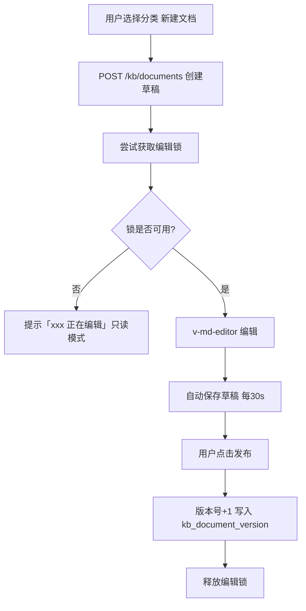
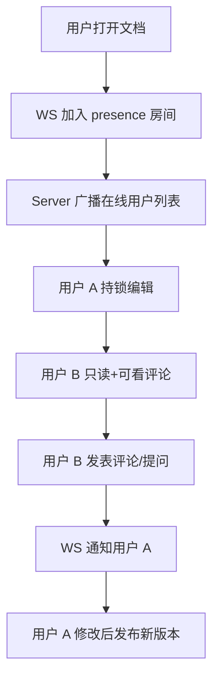
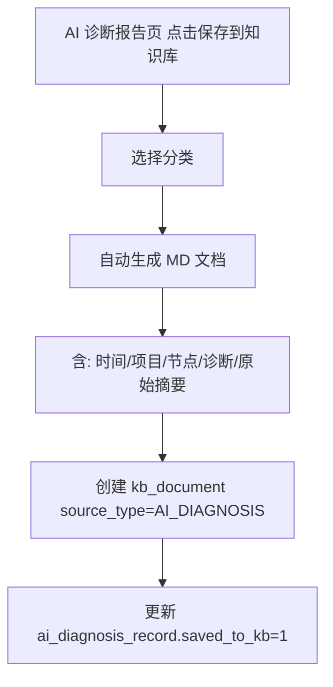

# 详细设计文档 v1.0 - 知识管理

## 1. 模块概述

知识管理模块为内网运维场景提供**一体化 Markdown 知识库**，支持分类、搜索、版本历史、**方案 A 协同**（编辑锁 + 在线人数 + 评论/聊天）、**图片上传/截图内嵌**、**文档导出下载**。不支持 PDF。AI 诊断报告可一键归档供开发查阅。

---

## 2. 系统架构

```
┌──────────────────────────────────────────────────────────────────────┐
│  KnowledgeView.vue                                                    │
│  ┌────────────┐ ┌──────────────┐ ┌────────────┐ ┌────────────────┐ │
│  │ 分类树     │ │ MD 编辑器    │ │ 预览/渲染  │ │ 评论/在线用户  │ │
│  │ (拖拽排序) │ │ v-md-editor  │ │            │ │                │ │
│  └─────┬──────┘ └──────┬───────┘ └─────┬──────┘ └───────┬────────┘ │
└────────┼───────────────┼───────────────┼─────────────────┼──────────┘
         │               │               │                 │
         ▼               ▼               ▼                 ▼
┌──────────────────────────────────────────────────────────────────────┐
│  Server: KnowledgeController / KnowledgeService                         │
│  ┌─────────────┐ ┌──────────────┐ ┌─────────────┐ ┌───────────────┐  │
│  │ 分类/文档   │ │ 版本管理     │ │ 全文搜索    │ │ 编辑锁        │  │
│  │ CRUD        │ │              │ │ (H2 LIKE)   │ │ (30min TTL)   │  │
│  └─────────────┘ └──────────────┘ └─────────────┘ └───────────────┘  │
│  ┌─────────────┐ ┌──────────────┐ ┌─────────────────────────────┐  │
│  │ 评论服务    │ │ Presence WS  │ │ 图片上传 / 文档导出下载      │  │
│  └─────────────┘ └──────────────┘ └─────────────────────────────┘  │
└──────────────────────────────┬───────────────────────────────────────┘
                               │
                               ▼
                    H2: kb_* 表 + data/kb/images/ + data/kb/docs/
```

### 2.1 开源方案评估（结论）

| 方案 | 优点 | 缺点 | 决策 |
|------|------|------|------|
| **Outline** | 体验好、协同强 | 需 PostgreSQL+Redis+S3 | ❌ 内网过重 |
| **memos** | 轻量、Markdown | 独立 Go 服务，需额外部署 | ❌ 不符合一体化 |
| **HedgeDoc** | 实时协同编辑 | 需 PostgreSQL | ❌ |
| **自研 Wiki** | 与 EasyOps 统一认证/权限/存储 | 需开发 | ✅ **采用** |

参考 Outline / GitHub Wiki 的交互设计，技术栈对齐现有 Vue3 + Spring Boot + H2。

---

## 3. 数据库设计

### 3.1 表：kb_category（知识分类）

| 字段名 | 类型 | 长度 | 必填 | 主键 | 说明 |
|--------|------|------|------|------|------|
| id | BIGINT | — | 是 | PK | 自增 |
| parent_id | BIGINT | — | 否 | — | 父分类，0=根 |
| name | VARCHAR | 100 | 是 | — | 分类名称 |
| icon | VARCHAR | 50 | 否 | — | 图标名 |
| sort_order | INT | — | 否 | — | 排序，默认 0 |
| project_id | BIGINT | — | 否 | — | 关联项目（空=全局） |
| create_time | BIGINT | — | 是 | — | 创建时间 |
| update_time | BIGINT | — | 是 | — | 更新时间 |

**索引设计：**
- PRIMARY KEY (id)
- INDEX idx_parent (parent_id)
- INDEX idx_project (project_id)

### 3.2 表：kb_document（知识文档）

| 字段名 | 类型 | 长度 | 必填 | 主键 | 说明 |
|--------|------|------|------|------|------|
| id | BIGINT | — | 是 | PK | 自增 |
| category_id | BIGINT | — | 是 | — | 分类 ID |
| title | VARCHAR | 300 | 是 | — | 标题 |
| summary | VARCHAR | 500 | 否 | — | 摘要（自动截取） |
| content | LONGTEXT | — | 是 | — | Markdown 正文 |
| content_size | INT | — | 否 | — | 字节数 |
| source_type | VARCHAR | 30 | 否 | — | MANUAL/AI_DIAGNOSIS/ALARM |
| source_id | BIGINT | — | 否 | — | 来源记录 ID |
| project_id | BIGINT | — | 否 | — | 关联项目 |
| author_id | BIGINT | — | 是 | — | 创建人 |
| last_editor_id | BIGINT | — | 否 | — | 最后编辑人 |
| version_no | INT | — | 是 | — | 当前版本号，默认 1 |
| status | TINYINT | — | 是 | — | 1=发布 0=草稿 |
| view_count | INT | — | 否 | — | 浏览次数 |
| create_time | BIGINT | — | 是 | — | 创建时间 |
| update_time | BIGINT | — | 是 | — | 更新时间 |

**索引设计：**
- PRIMARY KEY (id)
- INDEX idx_category (category_id)
- INDEX idx_project (project_id)
- INDEX idx_update (update_time)
- INDEX idx_title (title)

### 3.3 表：kb_document_version（文档版本历史）

| 字段名 | 类型 | 长度 | 必填 | 主键 | 说明 |
|--------|------|------|------|------|------|
| id | BIGINT | — | 是 | PK | 自增 |
| document_id | BIGINT | — | 是 | — | 文档 ID |
| version_no | INT | — | 是 | — | 版本号 |
| title | VARCHAR | 300 | 是 | — | 标题快照 |
| content | LONGTEXT | — | 是 | — | 内容快照 |
| editor_id | BIGINT | — | 是 | — | 编辑人 |
| change_note | VARCHAR | 500 | 否 | — | 变更说明 |
| create_time | BIGINT | — | 是 | — | 创建时间 |

**索引设计：**
- PRIMARY KEY (id)
- UNIQUE INDEX uk_doc_ver (document_id, version_no)

### 3.4 表：kb_comment（评论）

| 字段名 | 类型 | 长度 | 必填 | 主键 | 说明 |
|--------|------|------|------|------|------|
| id | BIGINT | — | 是 | PK | 自增 |
| document_id | BIGINT | — | 是 | — | 文档 ID |
| parent_id | BIGINT | — | 否 | — | 父评论（回复） |
| user_id | BIGINT | — | 是 | — | 评论人 |
| content | TEXT | — | 是 | — | 评论内容（支持 MD 子集） |
| rating | TINYINT | — | 否 | — | 评价 1-5 星（可选） |
| create_time | BIGINT | — | 是 | — | 创建时间 |
| update_time | BIGINT | — | 否 | — | 更新时间 |

**索引设计：**
- PRIMARY KEY (id)
- INDEX idx_doc_time (document_id, create_time)

### 3.6 表：kb_image（文档图片）

| 字段名 | 类型 | 长度 | 必填 | 主键 | 说明 |
|--------|------|------|------|------|------|
| id | BIGINT | — | 是 | PK | 自增 |
| document_id | BIGINT | — | 是 | — | 所属文档 |
| file_name | VARCHAR | 200 | 是 | — | 原始文件名 |
| file_path | VARCHAR | 500 | 是 | — | 磁盘路径 data/kb/images/{docId}/{id}.png |
| file_size | INT | — | 是 | — | 字节数 |
| mime_type | VARCHAR | 50 | 是 | — | image/png, image/jpeg 等 |
| uploader_id | BIGINT | — | 是 | — | 上传人 |
| create_time | BIGINT | — | 是 | — | 上传时间 |

**索引设计：**
- PRIMARY KEY (id)
- INDEX idx_document (document_id)

**限制：** 单图 ≤ 5MB；支持 png/jpg/jpeg/gif/webp；**不支持 PDF**。

### 3.7 表：kb_document_lock（编辑锁）

| 字段名 | 类型 | 长度 | 必填 | 主键 | 说明 |
|--------|------|------|------|------|------|
| document_id | BIGINT | — | 是 | PK | 文档 ID |
| user_id | BIGINT | — | 是 | — | 持锁用户 |
| user_name | VARCHAR | 50 | 是 | — | 用户名（展示） |
| lock_time | BIGINT | — | 是 | — | 加锁时间 |
| expire_time | BIGINT | — | 是 | — | 过期时间 |

**索引设计：**
- PRIMARY KEY (document_id)
- INDEX idx_expire (expire_time)

---

## 4. 核心流程设计

### 4.1 文档创建与编辑



### 4.2 协同感知（非 OT 实时协同）



### 4.3 AI 诊断归档



### 4.4 搜索与移动

```mermaid
flowchart TD
    A[搜索框输入关键词] --> B[GET /kb/search?q=]
    B --> C[H2: title/content LIKE + 按 update_time 排序]
    C --> D[返回高亮片段列表]
    D --> E[用户拖拽文档到其他分类]
    E --> F[PUT /kb/documents/{id}/move]
```

### 4.5 图片上传与文档下载

```mermaid
flowchart TD
    A[编辑中粘贴/截图/选择图片] --> B[POST /kb/documents/{id}/images]
    B --> C[存 data/kb/images/ 写 kb_image]
    C --> D[返回 URL 插入 MD]
    D --> E[预览渲染图片]
    F[用户点击下载] --> G{格式}
    G -->|MD| H[GET /kb/documents/{id}/export?format=md]
    G -->|ZIP| I[GET export?format=zip 含 md+图片]
```

---

## 5. API 接口设计

| 接口路径 | 方法 | 说明 | 权限 |
|----------|------|------|------|
| `/kb/categories` | GET | 分类树 | 登录用户 |
| `/kb/categories` | POST | 创建分类 | admin |
| `/kb/categories/{id}` | PUT | 更新分类（含移动/排序） | admin |
| `/kb/categories/{id}` | DELETE | 删除空分类 | admin |
| `/kb/documents` | GET | 文档列表（分页/按分类） | 登录用户 |
| `/kb/documents` | POST | 创建文档 | 登录用户 |
| `/kb/documents/{id}` | GET | 文档详情 | 登录用户 |
| `/kb/documents/{id}` | PUT | 更新文档 | 持锁用户 |
| `/kb/documents/{id}` | DELETE | 删除文档 | admin/作者 |
| `/kb/documents/{id}/move` | PUT | 移动到其他分类 | admin/作者 |
| `/kb/documents/{id}/lock` | POST | 获取编辑锁 | 登录用户 |
| `/kb/documents/{id}/unlock` | POST | 释放编辑锁 | 持锁用户 |
| `/kb/documents/{id}/versions` | GET | 版本历史 | 登录用户 |
| `/kb/documents/{id}/versions/{ver}` | GET | 查看历史版本 | 登录用户 |
| `/kb/documents/{id}/comments` | GET/POST | 评论列表/新增 | 登录用户 |
| `/kb/documents/{id}/images` | POST | 上传图片（粘贴/截图/文件） | 持锁用户 |
| `/kb/images/{imageId}` | GET | 获取图片（内网展示） | 登录用户 |
| `/kb/documents/{id}/export` | GET | 导出 MD 或 ZIP（含图片） | 登录用户 |
| `/kb/search` | GET | 全文搜索 | 登录用户 |

### 5.1 POST /api/kb/documents

**请求：**
```json
{
  "categoryId": 5,
  "title": "tm-server OOM 故障处理记录",
  "content": "# 故障概述\n\n2025-06-25 tm-node-2 发生 OOM...\n\n## 根因\n...\n\n## 解决方案\n...",
  "projectId": 1,
  "sourceType": "AI_DIAGNOSIS",
  "sourceId": 501,
  "status": 1
}
```

**响应：**
```json
{
  "code": 0,
  "data": {
    "id": 1001,
    "title": "tm-server OOM 故障处理记录",
    "versionNo": 1,
    "createTime": 1750000000000
  }
}
```

### 5.2 POST /api/kb/documents/{id}/lock

**响应：**
```json
{
  "code": 0,
  "data": {
    "locked": true,
    "expireTime": 1750001800000,
    "holder": { "userId": 1, "userName": "admin" }
  }
}
```

**锁冲突响应：**
```json
{
  "code": 1010,
  "message": "文档正在被 zhangsan 编辑",
  "data": {
    "locked": false,
    "holder": { "userId": 2, "userName": "zhangsan" },
    "expireTime": 1750001500000
  }
}
```

### 5.3 GET /api/kb/search

**请求：** `?q=OOM&page=1&pageSize=20`

**响应：**
```json
{
  "code": 0,
  "data": {
    "total": 3,
    "list": [
      {
        "id": 1001,
        "title": "tm-server OOM 故障处理记录",
        "summary": "...发生 OOM...",
        "highlight": "tm-node-2 发生 <em>OOM</em>",
        "categoryName": "故障案例",
        "updateTime": 1750000000000
      }
    ]
  }
}
```

### 5.4 POST /api/kb/documents/{id}/images

**请求：** `multipart/form-data`，字段 `file`

**响应：**
```json
{
  "code": 0,
  "data": {
    "imageId": 88,
    "url": "/api/kb/images/88",
    "markdown": ""
  }
}
```

### 5.5 GET /api/kb/documents/{id}/export

**请求：** `?format=md` 或 `?format=zip`

- `md`：直接下载 `.md` 文件（图片保留 URL 引用）
- `zip`：包含 `document.md` + `images/` 目录（离线可阅）

### 5.6 WebSocket：/ws/kb-presence

**客户端发送：**
```json
{ "action": "join", "documentId": 1001 }
```

**服务端推送：**
```json
{
  "action": "presence",
  "documentId": 1001,
  "viewers": [
    { "userId": 1, "userName": "admin", "editing": true },
    { "userId": 2, "userName": "zhangsan", "editing": false }
  ]
}
```

---

## 6. 关键技术点

- **Markdown 编辑**：`@kangc/v-md-editor` + `github-markdown-css` 预览主题
- **协同方案 A（已确认）**：编辑锁 30min + WS presence + 评论线程
- **图片**：`multipart` 上传；编辑器监听 `paste` 事件支持截图粘贴；存 `data/kb/images/`
- **下载**：`StreamingResponseBody` 输出 MD 或 ZIP
- **不支持 PDF** 附件
- **存储双写**：`kb_document.content` 存 H2；可选备份 `data/kb/docs/{id}.md`
- **版本管理**：每次发布（status=1）创建 `kb_document_version` 快照，最多保留 50 版本/文档
- **编辑锁**：30 分钟 TTL，心跳续期每 5 分钟；超时自动释放
- **搜索**：H2 `LIKE '%keyword%'`（内网数据量可控）；后期可升级 Lucene 嵌入式索引
- **XSS 防护**：渲染前 `DOMPurify` 消毒；评论内容同样过滤
- **权限**：全局分类 admin 管理；项目关联分类按 `user_project_relation` 过滤可见文档
- **聊天/评价**：评论即「聊天」；`rating` 字段支持对文档解决方案打分（1-5 星）

### 6.1 预设分类（初始化）

| 分类 | 说明 |
|------|------|
| 故障案例 | AI 诊断/告警归档默认分类 |
| 部署手册 | 应用部署步骤 |
| 配置说明 | 各应用配置项解释 |
| 常见问题 FAQ | 运维常见问题 |
| 开发交接 | 开发提供给运维的说明 |

---

## 7. 异常处理

| 异常场景 | 处理方式 | 返回码 |
|----------|----------|--------|
| 编辑锁被占用 | 返回持锁人信息，前端只读 | 1010 |
| 锁过期 | 自动释放，允许新用户获取 | 200 |
| 上传非图片文件（含 PDF） | 拒绝，提示仅支持图片 | 1001 |
| 单图超过 5MB | 拒绝 | 1001 |
| 删除非空分类 | 拒绝，提示先移动文档 | 1001 |
| 无权限查看项目文档 | SEC-004 校验 | 403 |
| 并发发布冲突 | 乐观锁 version_no 校验 | 1009 |
| WS 断连 | 5 分钟后从 presence 列表移除 | — |

---

## 8. 测试要点

1. 创建/编辑/发布 Markdown 文档，预览渲染正确（表格/代码块/标题）
2. 用户 A 持锁时用户 B 无法编辑，可只读查看
3. 锁 30 分钟超时后用户 B 可获取锁
4. 版本历史：发布 3 次后可回看 v1/v2 内容
5. 评论与回复线程展示正确，WS 实时通知
6. 搜索「OOM」命中标题和正文
7. 拖拽文档到其他分类成功
8. 截图粘贴上传后文内图片正常显示
9. 导出 ZIP 含图片，解压后可本地阅读
10. 上传 PDF 被拒绝

---

## 9. 前端页面设计要点

**KnowledgeView.vue**（路由 `/knowledge`）三栏布局：

| 栏位 | 宽度 | 内容 |
|------|------|------|
| 左 | 240px | 分类树 + 搜索框 + 「新建文档」 |
| 中 | flex | 文档列表（标题/摘要/更新时间） |
| 右 | 60% | 编辑器 + 预览 Tab + 评论抽屉 |

顶部 Tab：**编辑 | 预览 | 历史 | 评论**

菜单新增一级「协同知识 > 知识库」。
