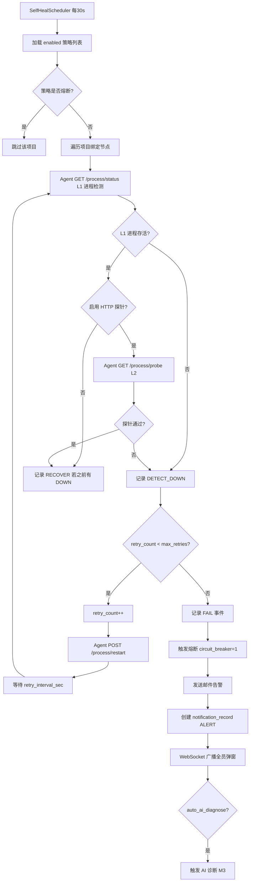
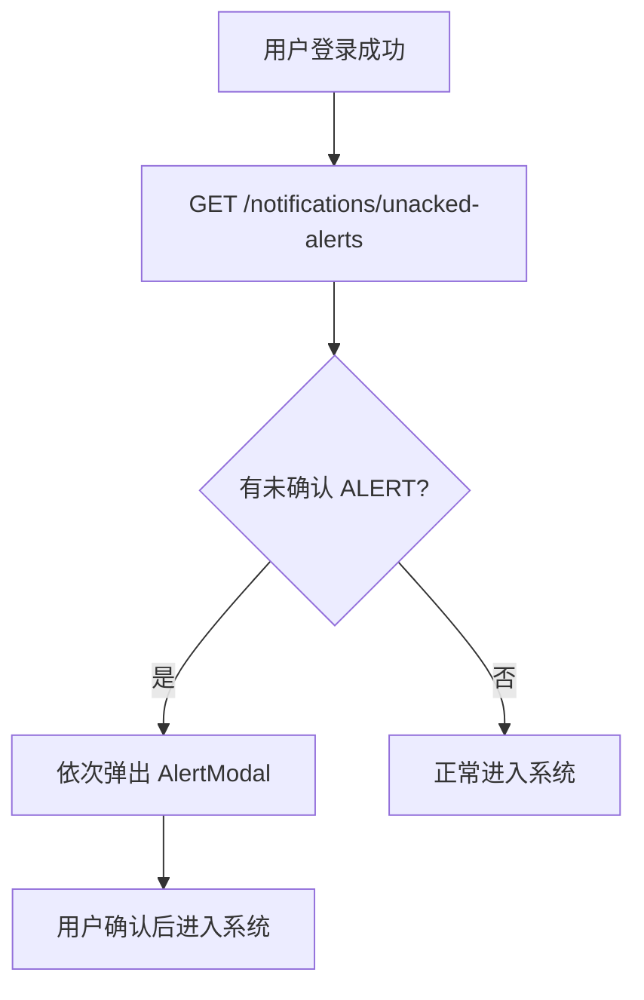
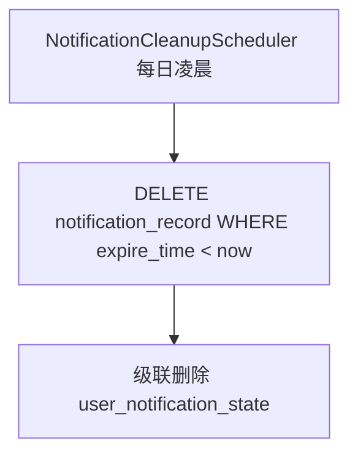

# 详细设计文档 v1.0 - 异常自动启动与实时告警

## 1. 模块概述

异常自动启动（自愈）模块为**独立功能域**，与现有 Agent `AutoRestartDaemon` 解耦，采用 **Server 统一调度 + Agent 执行** 架构。当微服务进程异常退出时，按项目策略自动尝试拉起（默认 3 次）；全部失败后发送邮件告警，并通过 WebSocket 向**所有在线运维用户**推送需手动关闭的显眼告警弹窗。告警与通知统一收录于右上角通知列表，**7 天后自动清理**。

---

## 2. 系统架构

```
┌───────────────────────────────────────────────────────────────────────┐
│  全局组件: NotificationBell.vue + AlertModal.vue (不可自动关闭)        │
│  SelfHealPolicyView.vue (独立管理页面)                                 │
└───────────────────────────────┬───────────────────────────────────────┘
                                │ REST + WS /ws/notification
┌───────────────────────────────▼───────────────────────────────────────┐
│  Server (独立模块包 com.ops.server.selfheal.*)                        │
│  ┌──────────────────┐  ┌──────────────────┐  ┌─────────────────────┐  │
│  │ SelfHealScheduler│  │ SelfHealService  │  │ NotificationService │  │
│  │ (定时检测 30s)   │  │ (重启编排)       │  │ (站内通知)          │  │
│  └────────┬─────────┘  └────────┬─────────┘  └──────────┬──────────┘  │
│           │                     │                        │             │
│           │            ┌────────▼────────┐    ┌─────────▼──────────┐  │
│           │            │ AlarmService    │    │ NotificationHandler│  │
│           │            │ (邮件 SMTP)     │    │ (WebSocket 推送)   │  │
│           │            └─────────────────┘    └────────────────────┘  │
│  ┌────────▼────────────────────────────────────────────────────────┐  │
│  │ H2: self_heal_policy / self_heal_event / notification_record    │  │
│  └─────────────────────────────────────────────────────────────────┘  │
└───────────────────────────────┬───────────────────────────────────────┘
                                │ HTTP
┌───────────────────────────────▼───────────────────────────────────────┐
│  Agent                                                                 │
│  GET  /process/status   — 进程存活检测（新增）                         │
│  POST /process/{id}/restart — 重启应用（已有）                         │
│  POST /process/pid        — 上报/更新 PID（新增）                      │
└───────────────────────────────────────────────────────────────────────┘
```

**模块独立性要求：**
- 代码目录：`server/.../selfheal/`、`server/.../notification/`
- 前端路由：`/self-heal` 独立入口
- 数据库表：独立前缀 `self_heal_*`、`notification_*`
- 可独立开关：`self_heal.enabled` 系统配置

---

## 3. 数据库设计

### 3.1 表：self_heal_policy（自愈策略）

| 字段名 | 类型 | 长度 | 必填 | 主键 | 说明 |
|--------|------|------|------|------|------|
| id | BIGINT | — | 是 | PK | 自增 |
| project_id | BIGINT | — | 是 | — | 项目 ID，唯一 |
| enabled | TINYINT | — | 是 | — | 是否启用，默认 1 |
| max_retries | INT | — | 是 | — | 最大重启次数，默认 3 |
| retry_interval_sec | INT | — | 是 | — | 重启间隔秒，默认 30 |
| check_interval_sec | INT | — | 是 | — | 检测间隔秒，默认 30 |
| circuit_breaker | TINYINT | — | 是 | — | 熔断状态 0=正常 1=熔断 |
| circuit_break_time | BIGINT | — | 否 | — | 熔断时间 |
| health_check_url | VARCHAR | 500 | 否 | — | **已废弃**，改用 `project_health_probe` 表 |
| notify_email | TINYINT | — | 是 | — | 失败是否发邮件，默认 1 |
| notify_popup | TINYINT | — | 是 | — | 失败是否弹窗，默认 1 |
| auto_ai_diagnose | TINYINT | — | 否 | — | 失败后自动 AI 诊断，默认 0 |
| create_time | BIGINT | — | 是 | — | 创建时间 |
| update_time | BIGINT | — | 是 | — | 更新时间 |

**索引设计：**
- PRIMARY KEY (id)
- UNIQUE INDEX uk_project (project_id)

### 3.2 表：self_heal_event（自愈事件）

| 字段名 | 类型 | 长度 | 必填 | 主键 | 说明 |
|--------|------|------|------|------|------|
| id | BIGINT | — | 是 | PK | 自增 |
| project_id | BIGINT | — | 是 | — | 项目 ID |
| node_id | BIGINT | — | 是 | — | 节点 ID |
| event_type | VARCHAR | 30 | 是 | — | DETECT_DOWN/RETRY/RECOVER/FAIL/CIRCUIT_BREAK |
| retry_count | INT | — | 否 | — | 当前重试次数 |
| max_retries | INT | — | 否 | — | 策略最大次数 |
| detail | TEXT | — | 否 | — | 事件详情 |
| process_pid | INT | — | 否 | — | 相关 PID |
| create_time | BIGINT | — | 是 | — | 事件时间 |

**索引设计：**
- PRIMARY KEY (id)
- INDEX idx_project_node_time (project_id, node_id, create_time)

### 3.3 表：notification_record（站内通知）

| 字段名 | 类型 | 长度 | 必填 | 主键 | 说明 |
|--------|------|------|------|------|------|
| id | BIGINT | — | 是 | PK | 自增 |
| type | VARCHAR | 30 | 是 | — | ALERT/INFO/SELF_HEAL |
| level | VARCHAR | 20 | 是 | — | CRITICAL/WARNING/INFO |
| title | VARCHAR | 300 | 是 | — | 通知标题 |
| content | TEXT | — | 是 | — | 通知内容（支持 MD 子集） |
| project_id | BIGINT | — | 否 | — | 关联项目 |
| node_id | BIGINT | — | 否 | — | 关联节点 |
| source_type | VARCHAR | 30 | 否 | — | SELF_HEAL/DEPLOY/MANUAL |
| source_id | BIGINT | — | 否 | — | 来源事件 ID |
| require_ack | TINYINT | — | 是 | — | 是否需手动关闭，ALERT=1 |
| broadcast | TINYINT | — | 是 | — | 是否全员广播，默认 1 |
| create_time | BIGINT | — | 是 | — | 创建时间 |
| expire_time | BIGINT | — | 是 | — | 过期时间（create+7天） |

**索引设计：**
- PRIMARY KEY (id)
- INDEX idx_type_time (type, create_time)
- INDEX idx_expire (expire_time)

### 3.4 表：user_notification_state（用户通知状态）

| 字段名 | 类型 | 长度 | 必填 | 主键 | 说明 |
|--------|------|------|------|------|------|
| id | BIGINT | — | 是 | PK | 自增 |
| notification_id | BIGINT | — | 是 | — | 通知 ID |
| user_id | BIGINT | — | 是 | — | 用户 ID |
| read_status | TINYINT | — | 是 | — | 0=未读 1=已读 |
| ack_status | TINYINT | — | 是 | — | 0=未确认 1=已确认关闭 |
| ack_time | BIGINT | — | 否 | — | 确认时间 |

**索引设计：**
- PRIMARY KEY (id)
- UNIQUE INDEX uk_user_notify (notification_id, user_id)
- INDEX idx_user_unread (user_id, read_status)

---

## 4. 核心流程设计

### 4.1 进程检测与自动重启



### 4.2 实时告警推送

```mermaid
flowchart TD
    A[创建 notification_record] --> B{require_ack=1?}
    B -->|是| C[NotificationHandler.broadcast]
    C --> D[所有在线 WS 连接收到 ALERT]
    D --> E[前端 AlertModal 弹出]
    E --> F[用户必须点击「我知道了」]
    F --> G[POST /notifications/{id}/ack]
    G --> H[更新 user_notification_state.ack_status=1]
    B -->|否| I[仅铃铛未读红点]
```

### 4.3 用户登录拉取未确认告警



### 4.4 通知自动清理



---

## 5. API 接口设计

| 接口路径 | 方法 | 说明 | 权限 |
|----------|------|------|------|
| `/self-heal/policies` | GET | 自愈策略列表 | operator+ |
| `/self-heal/policies` | POST | 创建/更新策略 | admin |
| `/self-heal/policies/{projectId}` | GET | 单项目策略 | operator+ |
| `/self-heal/policies/{projectId}/circuit-break` | POST | 解除熔断 | admin |
| `/self-heal/events` | GET | 自愈事件历史 | operator+ |
| `/notifications` | GET | 通知列表（分页） | 登录用户 |
| `/notifications/unread-count` | GET | 未读数量 | 登录用户 |
| `/notifications/unacked-alerts` | GET | 未确认告警列表 | 登录用户 |
| `/notifications/{id}/read` | POST | 标记已读 | 登录用户 |
| `/notifications/{id}/ack` | POST | 确认关闭告警 | 登录用户 |

### 5.1 POST /api/self-heal/policies

**请求：**
```json
{
  "projectId": 1,
  "enabled": true,
  "maxRetries": 3,
  "retryIntervalSec": 30,
  "checkIntervalSec": 30,
  "notifyEmail": true,
  "notifyPopup": true,
  "autoAiDiagnose": true
}
```

**响应：**
```json
{
  "code": 0,
  "data": {
    "id": 1,
    "projectId": 1,
    "enabled": true,
    "maxRetries": 3,
    "circuitBreaker": false
  }
}
```

### 5.2 GET /api/self-heal/events

**请求：** `?projectId=1&page=1&pageSize=20`

**响应：**
```json
{
  "code": 0,
  "data": {
    "total": 15,
    "list": [
      {
        "id": 101,
        "projectId": 1,
        "nodeId": 10,
        "nodeName": "tm-node-1",
        "eventType": "FAIL",
        "retryCount": 3,
        "maxRetries": 3,
        "detail": "3次重启均失败，进程无法保持运行",
        "createTime": 1750000000000
      },
      {
        "id": 100,
        "eventType": "RETRY",
        "retryCount": 2,
        "detail": "第2次自动重启",
        "createTime": 1750000000000
      }
    ]
  }
}
```

### 5.3 GET /api/notifications

**响应：**
```json
{
  "code": 0,
  "data": {
    "total": 5,
    "list": [
      {
        "id": 2001,
        "type": "ALERT",
        "level": "CRITICAL",
        "title": "【tm-server】tm-node-1 自愈失败",
        "content": "项目 tm-server 在节点 tm-node-1 上连续3次自动重启失败，已触发熔断。请立即介入处理。",
        "projectId": 1,
        "nodeId": 10,
        "requireAck": true,
        "readStatus": 0,
        "ackStatus": 0,
        "createTime": 1750000000000
      }
    ]
  }
}
```

### 5.4 WebSocket /ws/notification

**服务端推送（ALERT）：**
```json
{
  "action": "ALERT",
  "notification": {
    "id": 2001,
    "level": "CRITICAL",
    "title": "【tm-server】tm-node-1 自愈失败",
    "content": "...",
    "requireAck": true,
    "createTime": 1750000000000
  }
}
```

### 5.5 Agent 新增接口

**GET /api/process/status** — L1 进程存活
```
?deployDir=/home/stms/tm-server&jarName=tm.jar
```

**GET /api/process/probe** — L2 HTTP 探针（配置来自 `project_health_probe`）

**POST /api/process/{id}/restart** — 重启（Server 下发统一 `start.sh`，不依赖原 `startTm.sh`）

**响应示例（status）：**
```json
{
  "code": 0,
  "data": {
    "alive": false,
    "pid": null,
    "probeStatus": "DOWN",
    "probeDetail": "HTTP 502",
    "checkMethod": "PS_GREP+HTTP_PROBE"
  }
}
```

**检测逻辑（老微服务，零侵入）：**
1. L1：`ps aux | grep {deploy_dir} | grep {jar_name}` — **必开**
2. L2：按项目配置的 GET/POST/HEAD 探针 — **推荐开启**
3. `RUNNING` = L1 通过且（未配 L2 或 L2 通过）
4. 重启时 Server 生成并下发标准 `start.sh`/`stop.sh`，与历史脚本名无关

---

## 6. 关键技术点

- **独立模块**：`SelfHealModule` 配置类，`@ConditionalOnProperty` 控制启用
- **废弃 Agent AutoRestartDaemon**：加 `@Deprecated`，README 注明迁移
- **分布式锁**：多 Server 实例时 `scheduler_lock` 表保证检测任务单实例执行
- **WebSocket 广播**：`NotificationHandler` 维护 `Map<userId, WebSocketSession>`
- **弹窗不可自动关闭**：前端 `AlertModal` 无 `duration`、无 ESC 关闭、`maskClosable=false`
- **通知铃铛**：Header 右上角，未读数红点；点击展开 `a-drawer` 列表
- **7 天清理**：`expire_time = create_time + 7 * 86400000`，定时物理删除
- **邮件复用**：调用现有 `AlarmService` + SMTP 配置，`type=SELF_HEAL_FAIL`
- **JDK 8**：`ScheduledExecutorService` 调度检测任务

### 6.1 与现有告警中心关系

| 维度 | 现有 alarm_record | 新 notification_record |
|------|------------------|----------------------|
| 用途 | 邮件发送历史 | 站内实时通知 |
| 弹窗 | 无 | ALERT 强制弹窗 |
| 保留 | 永久（现状） | 7 天自动删除 |
| 关系 | 自愈失败同时写两者 | notification 驱动 UI |

---

## 7. 异常处理

| 异常场景 | 处理方式 | 返回码 |
|----------|----------|--------|
| 重启成功但健康检查仍失败 | 计入一次 retry | — |
| 节点离线 | 记录事件，不计入 retry，发 OFFLINE 通知 | — |
| 熔断中 | 不自动重启，仅人工解除 | 200 |
| 邮件发送失败 | 站内通知仍推送，alarm send_result=0 | 200 |
| WS 推送时用户离线 | 登录后 `unacked-alerts` 补弹 | 200 |
| 并发重启 | 节点级锁，同一节点不并行重启 | — |
| 策略未配置 | 使用默认值 enabled=1, maxRetries=3 | 200 |

---

## 8. 测试要点

1. 手动 kill 应用进程：30s 内检测到并自动重启
2. 连续失败 3 次：停止重启，熔断开启，邮件发出
3. 在线 3 个用户：均收到 WebSocket 弹窗，需各自手动关闭
4. 离线用户登录：弹出历史未确认 ALERT
5. 解除熔断后：恢复自动检测
6. 通知列表：显示标题/时间/级别/项目/节点
7. 7 天前通知被定时清理
8. 铃铛未读数与实际一致
9. 独立页面 `/self-heal` 可配置策略、查看事件
10. 进程 kill 后 L1 检测 DOWN，自动重启使用平台生成的 `start.sh` 成功

---

## 9. 前端设计要点

### 9.1 SelfHealPolicyView.vue（`/self-heal`）

| 区块 | 内容 |
|------|------|
| 策略表格 | 项目名/启用/最大次数/间隔/熔断状态/操作 |
| 事件时间线 | 选中项目的 DETECT_DOWN/RETRY/FAIL 事件 |
| 操作 | 编辑策略、解除熔断 |

### 9.2 全局 NotificationBell.vue

- 位置：Header 右上角（用户头像左侧）
- 红点：未读数
- 下拉/抽屉：通知列表，ALERT 红色左边框
- 点击 ALERT：展开详情 + 「确认已知」按钮

### 9.3 AlertModal.vue

```vue
<!-- 关键属性 -->
<a-modal
  :closable="false"
  :mask-closable="false"
  :keyboard="false"
  :footer="确认按钮"
/>
```

- `level=CRITICAL`：红色标题栏 + 声音提示（可选）
- 同一用户多个未确认 ALERT：队列依次弹出
