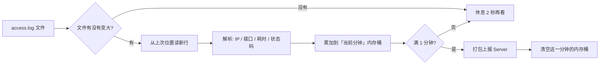

# Nginx 流量监控 — 详细设计文档 v1.0

> 面向内网传统微服务（Nginx + Spring Cloud Gateway + Eureka）的**轻量流量监控**方案。  
> 目标：知道「哪个 IP 调了哪个接口、调了多少次、响应快不快」，**不存原始日志**，不影响现有运维系统性能。

---

## 1. 先回答你最关心的几个问题

### 1.1 `remote_addr` 和 `http_x_forwarded_for`，哪个是对方 IP？

| 变量 | 含义 | 什么时候用它 |
|------|------|--------------|
| **`$remote_addr`** | 直接连到 Nginx 的那台机器的 IP | 客户端**直连 Nginx**（你们内网大概率是这种） |
| **`$http_x_forwarded_for`** | 请求头 `X-Forwarded-For` 里的 IP 链 | 前面还有**一层代理/负载均衡**时，这里才是真实客户端 |

**简单记法：**

```
客户端 ──直连──> Nginx     →  看 $remote_addr
客户端 ──> 别的代理 ──> Nginx  →  看 $http_x_forwarded_for 第一个 IP
```

你们截图里已经**两个都打了**，这是对的。系统里会这样取「客户端 IP」：

1. 如果 `X-Forwarded-For` 有值 → 取**第一个** IP（最左边是原始客户端）
2. 否则 → 用 `remote_addr`

> 注意：`X-Forwarded-For` 可以被伪造。内网如果只有 Nginx 一道入口，以 `remote_addr` 为准更稳。

---

### 1.2 日志打在哪？文件名是什么？会不会备份？

这些**不是 Nginx 自带的**，要在配置文件里写。常见写法：

```nginx
# 在 http {} 里定义格式（你们已有 log_format main）
access_log  /var/log/nginx/access.log  main;
```

| 问题 | 说明 |
|------|------|
| 默认路径 | 常见 `/var/log/nginx/access.log`，但以你们 `nginx.conf` 为准 |
| 会不会变大 | **会**，访问越多越大 |
| 会不会备份 | 生产一般用 **logrotate** 按天/按大小切分，旧文件变成 `access.log.1`、`access.log.2.gz` |
| 和 ELK 一样吗 | **原理类似**（都是写文件 + 轮转），但我们**不装 ELK**，由 EasyOps Agent 增量读取 |

**你需要做的（上线前确认一次）：**

```bash
# 在 Nginx 机器上执行，找到 access_log 配置
grep -r access_log /etc/nginx/

# 看当前日志文件
ls -lh /var/log/nginx/
```

把路径填到 EasyOps「Nginx 流量监控 → 日志源配置」里即可。

---

### 1.3 你们现在的日志格式全不全？

根据你同事发的配置，当前 `log_format main` 包含：

| 字段 | 作用 | 有没有用 |
|------|------|----------|
| `$time_iso8601` | 请求时间 | ✅ 必须 |
| `$remote_addr` | 直连 IP | ✅ 必须 |
| `$http_x_forwarded_for` | 代理链 IP | ✅ 建议保留 |
| `$request` | 方法 + 接口 + 协议 | ✅ 必须（如 `GET /api/order/list HTTP/1.1`） |
| `$status` | 状态码 200/404/500 | ✅ 必须 |
| `$body_bytes_sent` | 响应大小 | ✅ 可选统计 |
| `$request_time` | Nginx 处理总耗时（秒） | ✅ **慢接口分析** |
| `$upstream_response_time` | 后端（Gateway/微服务）耗时 | ✅ **慢接口分析** |
| `$upstream_addr` | 转到了哪台后端 | ✅ 定位后端节点 |
| `$http_host` | 访问的域名 | ✅ 多站点时有用 |
| `$http_user_agent` | 浏览器/客户端 | ⚠️ 第一期可不做排行 |
| `$http_referer` | 来源页面 | ⚠️ 第一期可不做排行 |

**结论：你们格式已经够用了**，比网上常见的 combined 格式还丰富，**不必为了监控再加字段**。

#### 关于 Nginx 版本

你说大概是 **1.4 左右**（可能是 1.14 / 1.18 这类）：

- `$time_iso8601`：需要 **≥ 1.3.12**
- `$request_time` / `$upstream_response_time`：老版本就有

如果真是很老的 1.4.x，把 `$time_iso8601` 换成 `$time_local` 也行，EasyOps 两种都支持解析。

#### 建议补一行（可选，多站点时更清晰）

```nginx
# 如果一台 Nginx 代理多个系统，可加 server_name 区分
"$server_name"
```

---

### 1.4 能不能做？怎么做才不拖垮系统？

**能做。** 核心原则就一条：

> **绝不整文件扫描。只读新增行，只存统计结果，不存原始日志。**

```
❌ 错误做法：每隔 1 分钟把 几万行 access.log 全读一遍 → 一定拖垮
✅ 正确做法：Agent 像 tail -f 一样跟着文件走，新来一行解析一行，按分钟汇总后上报
```

---

## 2. 整体架构（一张图看懂）

```
  内网用户
      │
      ▼
┌─────────────┐     access.log（可能每天轮转）
│   Nginx     │ ─────────────────────────────┐
└──────┬──────┘                              │
       │                                     │ 只读「新增内容」
       ▼                                     ▼
┌─────────────┐                    ┌─────────────────────┐
│  Gateway    │                    │  Agent（每台 Nginx） │
│  (可选第二期)│                    │  NginxAccessCollector│
└─────────────┘                    │  · 记录读到哪里了    │
                                   │  · 解析每一行        │
                                   │  · 内存里按分钟汇总  │
                                   │  · 每分钟上报一次    │
                                   └──────────┬──────────┘
                                              │ HTTP 上报（只有数字，没有原文）
                                              ▼
                                   ┌─────────────────────┐
                                   │  EasyOps Server      │
                                   │  · 写入分钟统计表    │
                                   │  · 每天汇总成日报    │
                                   │  · 提供查询 API      │
                                   └──────────┬──────────┘
                                              │
                                              ▼
                                   ┌─────────────────────┐
                                   │  前端新菜单           │
                                   │  「Nginx 流量监控」   │
                                   └─────────────────────┘
```

和现有「日志管理」的区别：

| | 现有日志管理 | 新 Nginx 流量监控 |
|--|-------------|------------------|
| 目的 | 人肉看报错 | **统计谁调了什么、调了多少** |
| 读法 | 每次 tail 尾部 N 行 | **持续跟着文件走** |
| 存什么 | 不存（只看） | **只存分钟/天汇总数字** |
| 性能 | 适合排障 | 适合**排名、趋势、告警** |

---

## 3. 性能设计（重点）

### 3.1 采集：Agent 端增量 tail



**关键技术点：**

| 点 | 做法 |
|----|------|
| 记住读到哪里 | 本地文件 `.nginx-offset.json` 存：`路径 + inode + 字节偏移` |
| 日志轮转了怎么办 | 发现文件变小或 inode 变了 → 从头读新文件 |
| 读多快 | 默认 **2 秒**看一次文件，只有有新内容才读 |
| 单条解析失败 | 跳过该行，写 WARN，**不影响整体** |
| 多个日志文件 | 每个文件独立一个采集任务、独立 offset |

**Agent 资源占用（预估）：**

- CPU：解析正则，每秒几百～几千行很轻松
- 内存：只保留「当前这一分钟」的 HashMap，默认 **< 10MB**
- 磁盘：只多一个几 KB 的 offset 文件
- 网络：每分钟上报一次 JSON，通常 **几 KB～几十 KB**

### 3.2 存储：只存汇总，不存原文

**不建「访问明细表」**（一行请求一条记录那种），数据量会爆。

只建两张统计表：

#### 表 1：`nginx_minute_stat`（分钟级，查排名用）

| 字段 | 说明 |
|------|------|
| source_id | 哪个日志源（哪台机器、哪个文件） |
| bucket_time | 分钟时间戳，如 `2026-07-31 19:05:00` |
| client_ip | 客户端 IP |
| uri | 接口路径（去掉 query 参数） |
| method | GET / POST |
| request_count | 这一分钟请求次数 |
| sum_request_time_ms | 总耗时（毫秒） |
| max_request_time_ms | 最大耗时 |
| sum_upstream_time_ms | 后端总耗时 |
| status_2xx / 4xx / 5xx | 各状态码次数 |

**一行 = 某一个 IP + 某一个接口 + 某一分钟 的汇总。**

查「最近 10 分钟 IP 排名」：

```sql
SELECT client_ip, SUM(request_count) AS total
FROM nginx_minute_stat
WHERE bucket_time >= 现在 - 10分钟
GROUP BY client_ip
ORDER BY total DESC
LIMIT 20;
```

**只扫最近 10 分钟的小表**，不碰 Nginx 原日志。

#### 表 2：`nginx_daily_stat`（天级，查趋势用）

每天凌晨把分钟表汇总进来，字段类似，但 `bucket_time` 变成日期。

用于：

- 今天总访问量
- 今天 Top 接口 / Top IP
- 最近 7 天趋势折线图

### 3.3 数据保留（自动清理）

| 数据 | 保留多久 | 说明 |
|------|----------|------|
| 分钟统计 | **7 天** | 够查「最近一周高峰」 |
| 天统计 | **90 天** | 看长期趋势 |
| 原始 Nginx 日志 | **不归我们管** | 还在 Nginx 机器上，logrotate 管 |

复用现有 `DataCleanupScheduler`，每天凌晨删过期数据。

### 3.4 防止「热点太多」撑爆内存

极端情况：某一分钟有上万个不同 IP 或接口。

保护措施（可配置）：

| 配置项 | 默认值 | 作用 |
|--------|--------|------|
| `max_keys_per_minute` | 2000 | 一分钟内最多记 2000 个 IP+接口组合 |
| 超出后 | 归入 `__OTHER__` | 保证内存有上限，排名仍可用 |

内网政府项目一般到不了这个量，但这是保险阀。

---

## 4. 功能设计（前端新菜单）

### 4.1 菜单位置

放在左侧 **「监控运维」** 分组下，和应用监控并列：

```
监控运维
  ├── 仪表盘
  ├── 应用监控
  ├── Nginx 流量监控    ← 新增
  ├── 告警中心
  └── ...
```

### 4.2 页面结构（4 个 Tab）

```
┌──────────────────────────────────────────────────────────────┐
│  Nginx 流量监控                                               │
├──────────┬──────────┬──────────┬────────────────────────────┤
│ 实时概览 │ 排名分析 │ 慢接口   │ 日志源配置                  │
└──────────┴──────────┴──────────┴────────────────────────────┘
```

---

#### Tab 1：实时概览

**解决：今天一共多少请求？现在忙不忙？**

| 区域 | 内容 |
|------|------|
| 顶部卡片 | 今日总请求 / 当前 QPS（最近 1 分钟）/ 4xx 数 / 5xx 数 |
| 折线图 | 最近 1 小时，每分钟请求量 |
| 下拉筛选 | 选日志源（哪台 Nginx）、时间范围 |

---

#### Tab 2：排名分析（你同事最需要的）

**解决：哪个 IP 调了哪个接口、影响有多大？**

| 功能 | 说明 |
|------|------|
| 时间窗口 | 1 分钟 / 5 分钟 / 10 分钟 / 30 分钟 / 自定义 |
| Top IP | 请求次数排名 + 占比进度条 |
| Top 接口 | URI 排名 |
| IP + 接口交叉表 | 选某个 IP → 看它调了哪些接口；选某个接口 → 看哪些 IP 在调 |
| 搜索框 | 输入 IP 或接口关键词过滤 |

**示例（最近 10 分钟）：**

```
Top IP 排名
  1. 192.168.10.23    3,842 次  ████████████████████  38%
  2. 192.168.10.55    1,205 次  ██████                12%
  ...

Top 接口排名
  1. POST /api/order/submit     2,100 次
  2. GET  /api/user/info        1,850 次
  ...
```

---

#### Tab 3：慢接口 / 超时分析

**解决：哪些接口慢？谁在拖慢系统？**

| 功能 | 说明 |
|------|------|
| 慢请求阈值 | 默认 `request_time > 3 秒`，可配置 |
| 慢接口排名 | 按「慢请求次数」排序 |
| 平均响应时间 | 按 URI 算平均 `request_time` |
| 后端耗时对比 | `upstream_response_time` vs `request_time`，判断慢在 Nginx 还是后端 |

| 指标 | 含义 |
|------|------|
| `request_time` 大、`upstream_response_time` 也大 | **后端慢**（Gateway / 微服务） |
| `request_time` 大、`upstream_response_time` 小 | **Nginx 自身或网络**问题 |

---

#### Tab 4：日志源配置

**解决：不知道日志在哪、有多个文件怎么办**

| 配置项 | 说明 |
|--------|------|
| 关联节点 | 选 Agent 节点（哪台 Nginx 机器） |
| 日志路径 | 绝对路径，如 `/var/log/nginx/access.log` |
| 日志格式 | 下拉选「标准 main（你们这种）」或自定义 |
| 采集开关 | 开 / 停 |
| 慢请求阈值 | 秒 |
| 支持多个 | 一台机器可配多个文件（如 `access.log` + `api.access.log`） |

页面上显示每个源的状态：

```
节点 agent-nginx-1  /var/log/nginx/access.log
  状态: 采集中 | 上次上报: 30秒前 | 今日已统计: 128,450 次
  当前读到: offset 45,231,008 | 最近错误: 无
```

---

## 5. 后端接口（简表）

| 接口 | 方法 | 作用 |
|------|------|------|
| `/nginx-traffic/sources` | GET/POST | 日志源配置 |
| `/nginx-traffic/sources/{id}/status` | GET | 采集状态 |
| `/nginx-traffic/overview` | GET | 实时概览 |
| `/nginx-traffic/rank/ip` | GET | IP 排名 |
| `/nginx-traffic/rank/uri` | GET | 接口排名 |
| `/nginx-traffic/rank/ip-uri` | GET | IP+接口交叉 |
| `/nginx-traffic/slow` | GET | 慢接口排名 |
| `/nginx-traffic/trend` | GET | 趋势图数据 |
| `/nginx-traffic/ingest` | POST | Agent 上报分钟汇总（内部） |

---

## 6. Agent 新增组件

```
agent/
  └── traffic/
        ├── NginxAccessCollector.java    # 主采集循环
        ├── NginxLogParser.java          # 解析 log_format main
        ├── MinuteBucketAggregator.java  # 内存分钟桶
        ├── OffsetTracker.java           # 文件偏移持久化
        └── TrafficReportClient.java     # 上报 Server
```

启动方式：Agent 启动时自动拉起，读取 Server 下发的日志源配置（或本地缓存）。

---

## 7. 和 Gateway 的关系（第二期，可选）

第一期 **只做 Nginx**，因为：

1. 你们今天就是在 Nginx 日志里查到问题的
2. Nginx 是统一入口，覆盖了绝大部分外部流量
3. 改动最小

第二期如果 Gateway 前面还有直连流量，在 Gateway 加一个 `AccessLogFilter`，写同样格式的日志，**复用同一套采集和统计逻辑**。

---

## 8. 告警（第三期，可选）

| 规则 | 示例 |
|------|------|
| QPS 突增 | 某接口 1 分钟内 > 500 次 |
| 单 IP 异常 | 某 IP 1 分钟内 > 1000 次 |
| 5xx 突增 | 5xx 占比 > 10% |
| 慢请求突增 | 慢请求 > 50 次/分钟 |

接入现有「告警中心 + 通知」，不另建系统。

---

## 9. 实施计划

### 第一期（核心，建议 2～3 周）

| 序号 | 内容 | 谁做 |
|------|------|------|
| 1 | 确认 Nginx 日志路径和格式 | **你** |
| 2 | Agent 增量采集 + 解析 + 分钟汇总 | **我** |
| 3 | Server 入库 + 查询 API | **我** |
| 4 | 前端 4 个 Tab 页面 | **我** |
| 5 | 联调：一台 Nginx 机器跑通 | **一起** |

### 第二期

- Gateway 访问日志
- 告警规则

### 第三期

- 导出报表（Excel）
- 多 Nginx 节点汇总对比

---

## 10. 分工清单

### 你需要做的

| 事项 | 说明 | 什么时候 |
|------|------|----------|
| ① 确认 access_log 路径 | 在 Nginx 机器 `grep access_log` | 开发前 |
| ② 确认 log_format 和线上一致 | 发一段真实日志样例（可打码 IP） | 开发前 |
| ③ 确认 Nginx 版本 | `nginx -v` | 开发前 |
| ④ 给 Agent 读日志的权限 | 确保运行 Agent 的用户能读 access.log | 上线前 |
| ⑤ 确认 logrotate 规则 | `cat /etc/logrotate.d/nginx` | 上线前 |
| ⑥ 第一期选 1 台 Nginx 试点 | 不要一上来全上 | 联调时 |
| ⑦ 重启 Server / 前端 | 功能开发完后 | 上线时 |

### 我来做的

| 事项 | 说明 |
|------|------|
| 数据库表 + 清理任务 | `nginx_minute_stat`、`nginx_daily_stat`、配置表 |
| Agent 采集模块 | 增量 tail、解析、汇总、上报 |
| Server API | 排名、趋势、慢接口、配置管理 |
| 前端页面 | 新菜单 + 4 个 Tab |
| 单元测试 | 解析器、汇总逻辑 |

---

## 11. 风险与应对

| 风险 | 应对 |
|------|------|
| 日志格式和线上不一致 | 配置页支持「贴一行样例自动识别」 |
| 日志轮转后漏读 | inode + offset 双检测，轮转后自动从头读 |
| 一分钟请求量极大 | `max_keys_per_minute` 上限 + `__OTHER__` 兜底 |
| H2 数据变大 | 只存汇总 + 7 天自动清理；分钟表单节点预估 < 50MB/周 |
| 多 Nginx 前面还有 SLB | 日志里 `remote_addr` 是 SLB IP → 必须依赖 `X-Forwarded-For` |

---

## 12. 附录 A：推荐 Nginx 配置（可直接给运维）

```nginx
http {
    # 全局代理头（你们已有）
    proxy_set_header Host              $host;
    proxy_set_header X-Real-IP         $remote_addr;
    proxy_set_header X-Forwarded-For   $proxy_add_x_forwarded_for;
    proxy_set_header X-Forwarded-Proto $scheme;

    # 日志格式（你们已有，基本不用改）
    log_format main
        '"$time_iso8601"'
        '"$remote_addr"'
        '"$http_x_forwarded_for"'
        '"$remote_user"'
        '"$request"'
        '"$status"'
        '"$body_bytes_sent"'
        '"$http_referer"'
        '"$http_user_agent"'
        '"$upstream_addr"'
        '"$request_time"'
        '"$upstream_response_time"'
        '"$http_host"';

    # 访问日志路径（按实际修改）
    access_log  /var/log/nginx/access.log  main;
}
```

如果 Nginx 版本太老不支持 `$time_iso8601`，把第一行换成 `"$time_local"`。

---

## 13. 附录 B：一行日志长什么样（帮助理解）

```
"2026-07-31T19:05:23+08:00" "192.168.10.23" "-" "-" "GET /api/order/list?page=1 HTTP/1.1" "200" "4521" "-" "Mozilla/5.0" "10.0.0.5:8080" "0.125" "0.118" "api.example.gov.cn"
```

| 位置 | 值 | 含义 |
|------|-----|------|
| 第 1 个 | 2026-07-31T19:05:23+08:00 | 时间 |
| 第 2 个 | 192.168.10.23 | 客户端 IP |
| 第 5 个 | GET /api/order/list?page=1 HTTP/1.1 | 方法和接口 |
| 第 6 个 | 200 | 成功 |
| 第 11 个 | 0.125 | 总耗时 0.125 秒 |
| 第 12 个 | 0.118 | 后端耗时 0.118 秒 |

系统会把 `?page=1` 去掉，统一成 `/api/order/list` 做统计（避免同一接口被拆成几百条）。

---

## 14. 附录 C：数据量粗算（让你放心）

假设：高峰期 **500 请求/秒**，即 3 万/分钟。

分钟表每行 = 一个 IP + 一个 URI 的组合。假设平均一分钟有 **200 种组合**：

| 项目 | 数量 |
|------|------|
| 每分钟写入 | 200 行 |
| 每天 | 200 × 60 × 24 ≈ **28 万行** |
| 每行大小 | ~200 字节 |
| 7 天存储 | 28万 × 7 × 200B ≈ **400MB** |

H2 完全扛得住。且我们只存数字，不存日志原文。

---

## 15. 总结

| 问题 | 答案 |
|------|------|
| 能不能做？ | **能** |
| 会不会拖垮系统？ | **不会**，增量读 + 只存汇总 |
| 哪个是对方 IP？ | 直连用 `remote_addr`；有代理用 `X-Forwarded-For` 第一个 |
| 日志格式够吗？ | **够了**，不用加字段 |
| 怎么排名？ | 按分钟汇总，查时间窗口内 SUM，不扫原日志 |
| 日志文件在哪？ | 看 `nginx.conf` 里 `access_log`，需在系统里配置 |
| 第一期做什么？ | Nginx 采集 + 排名 + 慢接口 + 配置页 |

---

**文档版本**：v1.0  
**日期**：2026-07-31  
**下一步**：你确认第 10 节「你需要做的」①～③，我就开始写代码。
