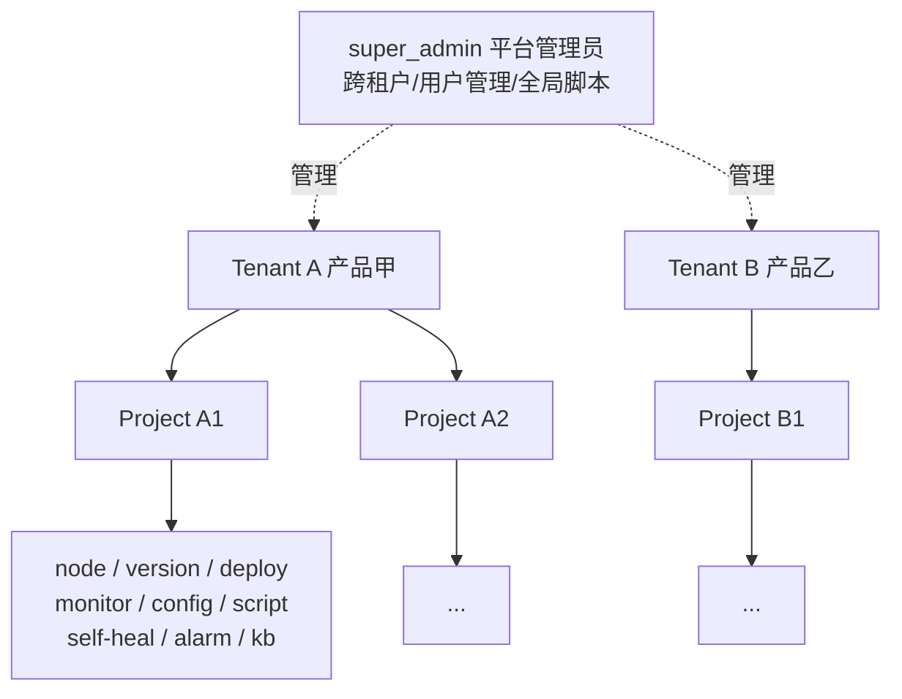
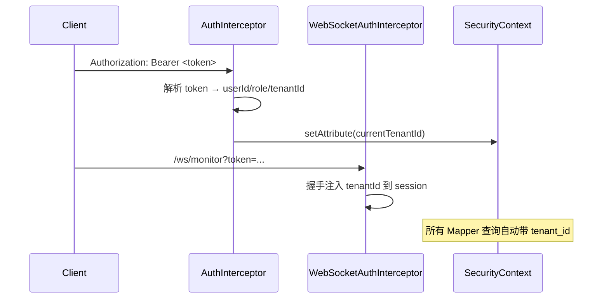

# EasyOps 多租户与数据隔离 · 架构设计文档

> 版本：v1.0（设计稿，待评审）
> 适用范围：EasyOps 后端（`backend/server`、`backend/agent`、`backend/common`）+ 前端（`frontend`）
> 调研依据：基于仓库真实代码与 `schema.sql`（54 张表）逐模块检索，所有结论均标注代码/表位置。
> 目标读者：架构决策者（你）、后端/前端实现者。

---

## 0. 阅读导航（TL;DR）

你最关心的两个问题，先给结论：

1. **"改动是不是非常非常大？"**
   - **大，但主要是"机械式增列 + 加 WHERE + 注入上下文"，单点风险低；真正的系统性风险是"漏一处就泄漏"。**
   - 量化：约 **34 张业务表**需加 `tenant_id`；约 **15+ 个列表/下拉接口**需加租户过滤；**2 个 WebSocket 广播通道**（`/ws/monitor`、`/ws/notification`）必须按租户拆分；前端约 **17 个下拉/列表 API 调用** + 角色门控 + WS 连接参数。
   - 好处：可以**分阶段止血**，Phase 1 就能让"用户 A 只看自己负责的项目数据"成立，不必一次性全做完。

2. **"如果不加租户，怎么做数据隔离？"**
   - 系统**已经存在项目级隔离的雏形**（`user_project_relation` + `SecurityContext`），但只在部分模块真正生效。
   - 方案 A（只加固项目级、不加租户）：把缺失的隔离补齐即可，blast radius 小一个数量级；**但无法隔离"互不信任的独立产品/业务线"**——因为它们都在同一个 project 命名空间里，admin 能看到全部。
   - 方案 B（引入 `tenant_id` 行级隔离）：能彻底隔离多个产品，但改动面如上所述。
   - **选型建议**：如果你说的"多个产品"是互不信任的独立业务线 → 必须方案 B；如果只是"同一组织内不同用户看不同项目" → 方案 A 足够，且能 90% 复用现有 `SecurityContext`。

下面第 2 节完整对比两种方案，第 8 节量化评估，第 9 节给出可中断的分阶段路线。

---

## 1. 现状盘点（基于真实代码，非臆测）

### 1.1 隔离模型现状：只有"项目级"，没有"租户级"

- 全仓检索 `tenant|product|workspace|isolation`：**无任何租户/产品概念**（唯一命中是 `LogController` 里一句无关注释）。
- 当前隔离的最小粒度是 **Project（项目）**，靠两张表实现：
  - `user_project_relation(user_id, project_id)` —— 用户↔项目授权。
  - `SecurityContext.java`（`backend/server/.../util/SecurityContext.java`）：
    - `getAccessibleProjectIds()`：admin 返回全部 `project_info.id`；普通用户返回 `user_project_relation` 里自己的项目。
    - `hasProjectPermission(projectId)`：admin 恒 true；普通用户查关系表。
- **关键缺陷**：`getAccessibleProjectIds()` 目前**几乎没被用于查询过滤**，只在少数写入口做了 `hasProjectPermission` 校验。大量列表接口是 **GLOBAL（无项目/租户过滤）**。

### 1.2 用户/权限现状（含安全缺陷清单 —— 直接对应你的需求 #1）

- 用户模型 `UserModel`（`backend/common/.../model/UserModel.java`）：`id, username, password, role(String), status, createTime, updateTime`。**无 `tenant` 字段；角色只有 `admin` vs 其他（前端约定 `OPERATOR`）**。
- 用户接口全部在 `SystemController`（`@RequestMapping("/auth")`），**写接口完全无角色校验**：
  - `POST /auth/users`（创建）：无校验，且 `role` 为空时**默认 `"admin"`**（`SystemController.java:316-318`）→ 任意登录用户可把自己/他人提权为 admin。
  - `PUT /auth/users/{id}`（修改）：可改 `role/status/password`，无校验 → 可把任意用户提权或解禁自己。
  - `DELETE /auth/users/{id}`（删除）：无校验 → 可删 admin 账号。
  - `GET /auth/users`（列表）：无校验 → 任意用户可见全部用户。
  - 唯一有 admin 校验的是 `POST /auth/reset`（重置密码）。
- 前端 `UserListView.vue` / `UserFormView.vue`：**无任何 `v-if="isAdmin"` 门控**，三个操作按钮对所有人可见；且 `UserFormView.vue:78` 把 `role` 硬编码为 `'ADMIN'`——UI 只能建 admin。
- 结论：**需求 #1 当前完全没实现，且存在越权提权漏洞**。修复设计见第 11 节。

### 1.3 模块—表—接口盘点总表

下表是后续所有改造的"底图"。`作用域` 指当前 SQL/接口的过滤状态。

| 模块 | 表 | 现有隔离键 | 当前作用域 | 是否需加 tenant_id |
|---|---|---|---|---|
| 节点管理 | `node_info` | 无（反范式靠 `project_info.node_ids`） | GLOBAL | 是（反范式冗余 `tenant_id`） |
| 应用/项目 | `project_info` | 自身即项目主表 | GLOBAL | 是 |
| 版本管理 | `version_package` | `project_id` | 按 project | 是 |
| 一键部署 | `deploy_record` | `project_id,node_id` | 按 project（projectId 可空→全量） | 是 |
| 应用监控 | `monitor_snapshot` | `project_id,node_id` | 按 project | 是 |
| Agent 状态 | 经 `node_info`+`monitor_snapshot` | — | GLOBAL | 随节点 |
| 告警 | `alarm_record` | `project_id,node_id` | 缺省全量 | 是 |
| 自愈策略/事件 | `self_heal_policy`,`self_heal_event` | `project_id` | 缺省全量 | 是 |
| 通知 | `notification_record` | `project_id,user_id` | 按 user+广播 | 是（附加维度） |
| AI 诊断 | `ai_diagnosis_record` | `project_id` | 按 id（无列表） | 是 |
| 配置文件 | `project_config_file` | `project_id` | 已隔离✅ | 是（套 tenant） |
| 配置快照/分发 | `node_config_snapshot`,`config_distribute_record` | `project_id,node_id` | 已隔离✅ | 是 |
| 日志/探针 | `project_log_profile`,`project_health_probe` | `project_id` | 已隔离✅ | 是 |
| 脚本 | `project_script_file`,`script_distribute_record` | `project_id` | 已隔离✅ | 是 |
| 节点脚本快照 | `node_script_snapshot` | `project_id,node_id` | ⚠️**DDL 缺失** | 是（+ 补 DDL） |
| 知识库 | `kb_document`,`kb_category` 等 11 张 | `project_id`（列存在但**读不用**） | GLOBAL⚠️ | 是（doc 级） |
| 知识库目录/模板/分享 | `kb_tag`,`kb_template`,`kb_share_link` | 无/全局 | GLOBAL⚠️ | 决策（见 4.4） |
| Nginx 流量 | `nginx_minute_stat` 等 4 张 + `nginx_access_source` 等 3 张 | `source_id`（→`node_id`→`project`） | GLOBAL⚠️ | 是（经 source 推导） |
| 全局脚本 | `global_script_file`,`global_script_distribute_record` | 无（平台级） | GLOBAL | 否（限管理员） |
| 用户 | `sys_user` | — | 跨租户目录 | 加 `tenant_id`（解析用） |
| 操作审计 | `operation_log` | `user_id,module` | GLOBAL | 决策（限 admin） |
| 文件访问审计 | `file_access_log` | `node_id` | 仅写 | 决策（附 tenant） |
| 平台配置 | `sys_config`,`alarm_config`,`scheduler_lock` | — | 平台全局 | 否 |

> 标 ✅ 的是现状已通过 `hasProjectPermission` 隔离良好的模块，租户化后只需把过滤条件从"项目"上提到"租户"即可，风险最低。标 ⚠️ 的是**当前就存在跨项目/跨租户泄漏**的高危模块。

---

## 2. 需求澄清与两种方案

### 2.1 你的需求拆解

- **需求 #1（用户权限）**：admin 可增删改用户；普通用户只能改自己的资料。
- **需求 #2（租户/数据隔离）**：
  - (a) 节点管理不能混在一起 → 节点要按租户隔离。
  - (b) 全面考虑：应用管理、版本管理、一键部署、应用监控等关键模块都要设计。
  - 你可能有**多个产品**：当前节点注册/应用管理是一个产品，后续会有其他产品。
  - 权限页希望"每个用户拥有不同的数据隔离功效"——用户 A 只能看自己负责的节点/版本/部署/监控。
  - 你明确点名：**Nginx 流量监控、不同产品的数据隔离、Agent 状态**都可能涉及；**告警配置、自愈策略**是否纳入也要定。

> 术语统一：你口中的"多个产品/业务线"在架构上即**多个租户（Tenant）**。一个租户内若还需再分子业务线，可在 `project_info` 上挂一个可选的 `product_id` 标签（当前已有 `project_type` 字段可扩展），**隔离仍走 `tenant_id`**，不另建隔离轴。

### 2.2 方案 A：纯项目级隔离加固（不加租户）

**思路**：不动表结构，只把现有 `SecurityContext` 的项目级隔离**在所有模块真正落地**。

- 修复清单（对应 1.3 中标 ⚠️ 的模块）：
  - `GET /nodes`、`GET /nodes/export`、`GET /agent-upgrade/nodes`、`GET /monitor/agent/status` → 加 `IN (本用户可访问项目对应的节点)`。
  - Nginx 流量：`resolveSourceIds()` 加入"项目→节点→source"推导，拒绝自由传入他人 source。
  - 告警/自愈列表：`projectId` 缺省时套 `getAccessibleProjectIds()`。
  - 知识库：列表/搜索/详情全部加 `project_id` 过滤，接入 `kb_document_permission`。
  - 全局脚本：改为仅 admin 可访问。
- **优点**：blast radius 极小（~10 个接口 + 几张查询），无表结构变更，无存量数据迁移。
- **缺点 / 致命限制**：所有项目仍在**同一个 project 命名空间**；admin 能看到全部；不同"产品"之间靠"不把项目授权给跨产品用户"来人为隔离，**一旦 admin 误操作或需要平台级统计就会串**。无法支撑"互不信任的独立产品"。

### 2.3 方案 B：引入租户（`tenant_id` 行级隔离）—— 推荐

**思路**：共享数据库 + 每张业务表加 `tenant_id` 列 + 请求上下文注入当前租户 + 所有读写自动带 `tenant_id`。

- 隔离层次：`Tenant（租户/产品）⊃ Project（项目）⊃ Data（节点/版本/部署/监控/...）`。
- 执行原则（双层）：**第一层租户**（所有查询必须有 `tenant_id = 当前租户`，super admin 可绕过）；**第二层项目**（沿用 `getAccessibleProjectIds()`，在租户内再细分到用户可见项目）。
- **优点**：彻底隔离多产品；admin 只能看自己租户；平台级能力（全局脚本、平台配置）用"super admin"单独承载。
- **缺点**：~34 张表加列、~15 接口加过滤、2 个 WS 广播改造、前端上下文；有存量数据回填。

### 2.4 方案对比与选型

| 维度 | 方案 A（项目级加固） | 方案 B（租户行级隔离） |
|---|---|---|
| 表结构变更 | 0 | ~34 张加 `tenant_id` |
| 受影响接口 | ~10 | ~15+（且多数已带 project 过滤，只是加一列） |
| 存量数据迁移 | 无 | 需回填 default 租户 |
| 能否隔离独立产品 | ❌（同一命名空间） | ✅ |
| 实现复杂度 | 低 | 中（机械但点多） |
| 推荐场景 | 单一组织内"按用户分项目看" | 多产品/多客户/独立业务线 |

**选型建议**：若"多个产品"是未来确定要支撑的独立业务线 → **方案 B**；若仅是内部不同团队分项目 → **方案 A 先止血**，B 作为演进路线。

---

## 3. 推荐方案（方案 B）总体架构

### 3.1 隔离层次模型



### 3.2 租户上下文（TenantContext）

在现有 `SecurityContext` 上扩展（不要另起一套，避免双上下文漂移）：

- `getCurrentTenantId()`：从 `request.getAttribute("currentTenantId")` 读。
- `getAccessibleTenantIds()`：super_admin 返回全部；tenant_admin/operator 返回自己的租户（单值）。
- `assertTenantMatch(entityTenantId)`：写操作时校验"操作的行属于当前租户"，防越权。
- 解析来源：登录时 `sys_user.tenant_id` 入 token；`AuthInterceptor` 解析后写入 request attribute（与现有 `currentUserId/currentRole` 同机制）。

### 3.3 鉴权链路改造



- `AuthInterceptor.java`：在现有 `validateUserToken` 里把 `tenantId` 一并写入 request attribute（token 缓存 `TokenData` 增加 `tenantId` 字段）。
- `WebSocketAuthInterceptor.java`（`beforeHandshake`）：当前只取 `userId/username`，补取 `tenantId` 放进 session attributes——**这是 WS 隔离的入口**。

### 3.4 数据隔离执行原则（双层）

```
所有业务查询 WHERE 模板：
  WHERE tenant_id = #{currentTenantId}
    [AND (project_id IN (#{accessibleProjectIds}) OR currentRole=admin-in-tenant)]
    [AND <原有业务条件>]
super_admin 查询：去掉 tenant_id 条件（平台视图），但需显式标记，避免误用。
```

---

## 4. 数据模型改造清单（逐表）

### 4.1 需要加 `tenant_id` 的业务表（约 34 张）

**直接加列 + 索引即可（均有 project/node/source 可推导租户）：**

核心运维（8）：`node_info`、`project_info`、`version_package`、`deploy_record`、`monitor_snapshot`、`alarm_record`、`self_heal_policy`、`self_heal_event`
配置/脚本/日志/探针（7）：`project_config_file`、`node_config_snapshot`、`config_distribute_record`、`project_log_profile`、`project_health_probe`、`project_script_file`、`script_distribute_record`
AI/通知（2）：`ai_diagnosis_record`、`notification_record`
节点脚本快照（1）：`node_script_snapshot`（⚠️ **同时补建缺失 DDL**）
知识库（11）：`kb_category`、`kb_document`、`kb_document_version`、`kb_comment`、`kb_document_permission`、`kb_document_lock`、`kb_image`、`kb_document_tag`、`kb_favorite`、`kb_recent_access`（子表经 `document_id` 继承父文档 tenant，service 层强制）
Nginx 流量（7）：`nginx_access_source`、`nginx_source_whitelist`、`nginx_minute_stat`、`nginx_ua_stat`、`nginx_referer_stat`、`nginx_request_sample`、`nginx_traffic_alarm_rule`（经 `source_id→node_id→project→tenant` 推导）
Agent 升级（1）：`agent_upgrade_record`（经 `node_id` 推导）；`global_script_snapshot` 同理（或保留全局，见 4.2）

> 改造方式统一：在 `schema.sql` 用 `ALTER TABLE ... ADD COLUMN IF NOT EXISTS tenant_id BIGINT DEFAULT 0;` + 在对应 Mapper 的 `insert/select/update/delete` 补 `tenant_id`。高基表（`nginx_minute_stat` 等）需加复合索引含 `tenant_id`。

### 4.2 保持全局 / 平台级的表（及处理策略）

| 表 | 策略 |
|---|---|
| `sys_user` | 加 `tenant_id` 但作为**解析用**（用户目录跨租户，super_admin 管理） |
| `sys_config`,`alarm_config`,`scheduler_lock` | 平台全局，不加 tenant；仅 super_admin 改 |
| `global_script_file`,`global_script_distribute_record` | 平台管理员专属（不绑定项目），**接口加 super_admin 校验** |
| `operation_log` | 决策：建议限 super_admin 可见（审计本就平台级） |
| `file_access_log` | 决策：写入时附 `tenant_id`（经 node→project 推），查询限本租户/管理员 |
| `kb_tag`,`kb_template` | 决策：作为**共享目录**保留全局（只读模板/标签），不隔离；或按租户复制——推荐共享只读 |
| `kb_share_link` | 凭 token 取文档的入口，**访问时按文档 tenant 校验**当前用户是否同租户 |

### 4.3 关键难点：`node_info` 无 `project_id`

- 现状：节点归属项目靠 `project_info.node_ids`（逗号串），`node_info` 本身无 project/tenant。
- 改造：**给 `node_info` 反范式冗余 `tenant_id`**（与 `project_info.tenant_id` 一致），注册/心跳建节点时从所绑项目推断并写入；存量节点按"它出现在哪些项目的 `node_ids`"回填（通常一个节点只属一个租户）。这样节点列表/监控/WS 都能直接用 `tenant_id` 过滤，无需每次 `FIND_IN_SET` 反查。

### 4.4 知识库 / 全局脚本 / 操作日志的隔离决策

- **知识库**：`kb_document.tenant_id` 为隔离主键，列表/搜索/详情/分享全部强制；子表经 `document_id` 继承；`kb_tag`/`kb_template` 作为共享目录**只读共享**，不隔离（降低复杂度，且标签/模板本就该跨租户复用）。
- **全局脚本**：明确是"平台管理员管理所有 Agent"的能力，**限 super_admin**，不做租户隔离（符合现有注释意图）。
- **操作日志**：建议**仅 super_admin** 可见全部；普通用户不可见他人日志（防信息泄漏）。

---

## 5. 各模块隔离策略（逐菜单）

按前端菜单（`MainLayout.vue` 四分组）逐项给出策略：

### 运维核心
| 菜单 | 接口 | 策略 |
|---|---|---|
| 节点管理 | `GET /nodes`,`/nodes/export` | 加 `tenant_id`（节点已冗余）；下拉 `getNodes` 同步过滤 |
| 应用管理 | `GET /projects`(`findByFilters` GLOBAL) | 加 `tenant_id`；admin 视图走全部 |
| 版本管理 | `GET /versions`(按 projectId) | 经 project 推 tenant，列表强制 |
| 一键部署 | `GET /deploy`(projectId 可空) | 缺省时按 tenant+accessibleProjects 过滤 |

### 运维工具
| 菜单 | 接口 | 策略 |
|---|---|---|
| 配置文件管理 | `/config/files`(已隔离✅) | 套 tenant（加列+WHERE） |
| 日志管理 | `/logs/*`(已隔离✅) | 套 tenant |

### 监控告警
| 菜单 | 接口 | 策略 |
|---|---|---|
| 仪表盘 | `/monitor/app/dashboard` | 已有 `getAccessibleProjectIds` 内存裁剪 → 改走 tenant |
| 应用监控 | `/monitor/app/*` | 已有 `hasProjectPermission` → 加 tenant |
| Agent 状态 | `/monitor/agent/status`(GLOBAL⚠️) | 加 `tenant_id` 过滤（节点冗余列） |
| Nginx 流量监控 | `/nginx-traffic/*`(GLOBAL⚠️) | `resolveSourceIds` 加 tenant 推导；`listSources` 加 tenant |
| 告警中心 | `/alarms`(缺省全量⚠️) | `projectId` 缺省套 tenant+accessibleProjects |
| 告警配置 | `/alarm-config` | 平台 SMTP 配置 → **super_admin 专属**，不隔离 |
| 自愈策略 | `/self-heal/policies`,`/events`(缺省全量⚠️) | 同告警 |

### 系统设置
| 菜单 | 接口 | 策略 |
|---|---|---|
| 用户管理 | `/auth/users` | 跨租户用户目录 + 角色门控（见 #1 / 第 11 节） |
| H2 表结构维护 | `/db/*` | 平台全局，super_admin 专属 |
| 操作审计 | `/operations` | 建议 super_admin 可见 |

---

## 6. WebSocket 实时层隔离（重点风险）

后端**不是** STOMP/SockJS，而是 Spring 原生 `WebSocketHandler`（`TextWebSocketHandler`）+ `ConcurrentHashMap` 存 session，手动 `session.sendMessage`。因此隔离要在**每个 Handler 的广播逻辑里按租户过滤 session**，而不是改 broker 的 userDestination。

| Endpoint | Handler | 当前范围 | 风险 | 改造 |
|---|---|---|---|---|
| `/ws/monitor` | `MonitorHandler` | **广播全员**（注释明写"不做租户隔离"） | 🔴 最高 | 广播前按 `tenantId` 过滤 `monitorSessions`；或前端订阅带 tenant |
| `/ws/notification` | `NotificationHandler` | **广播全员**（含 `broadcast=1`） | 🔴 最高 | 按 tenant 过滤；`broadcast` 通知仅发同租户 |
| `/ws/deploy` | `DeployHandler` | 按 `deployId` 房间 | 🟡 | 校验该 deploy 属当前租户 |
| `/ws/console` | `ConsoleHandler` | 按 `projectId+nodeId` 房间 | 🟡 | 校验用户对 project/node 的租户归属 |
| `/ws/kb-collab` | `KbCollabHandler` | 按 `docId` 房间 | 🟡 | 校验用户对文档的租户归属 |

> 切入点：`WebSocketAuthInterceptor.beforeHandshake` 注入 `tenantId` 到 session attributes；各 Handler 的 `broadcast()` 改为 `broadcastToTenant(tenantId, msg)`。
> 附带 bug：`useCollab.ts:39` 硬编码 `localhost:8081`，多实例/多租户部署必断，建议改为 `location.host`。

---

## 7. 前端影响

1. **角色门控（修 #1）**：`UserListView/UserFormView` 加 `v-if="isAdmin"`；非 admin 隐藏新增/删除，编辑仅自己。`authStore.user.role` 已可用（`ADMIN`/`OPERATOR`）。
2. **租户上下文**：登录返回带 `tenantId`；全局 `request` 拦截器/状态库持有；下拉/列表 API 不必每次传 tenant（后端从 token 推断），但 WS 连接需带（或后端从 token 推断）。
3. **下拉/列表接口**（约 17 个，必须租户过滤）：`getNodes`、`getProjects`、`listNginxSources`、`getAgentUpgradeNodes`、`listConfigFiles`、`listScriptFiles`、`listCategories`、`listDocuments`、`listTags`、`listTemplates`、`listPolicies`、`listEvents` 等——**后端过滤即可，前端无需大改**，但需确认这些接口不再返回跨租户数据。
4. **WS 连接**：`AppMonitorView`(`/ws/monitor`)、`NotificationBell`(`/ws/notification`) 当前只带 token；后端从 token 推断 tenant 后前端基本无感，但心跳/订阅逻辑要确认不依赖"看到所有人数据"。
5. **租户切换器**（仅 super_admin）：若需要平台管理员在 UI 切换查看某租户，加一个租户下拉 + 把 `tenantId` 放进请求头（可选，Phase 末做）。

---

## 8. 改动范围评估（直接回答"是不是非常大"）

### 8.1 量化

| 维度 | 数量 | 说明 |
|---|---|---|
| 业务表加 `tenant_id` | ~34 张 | 含 `node_info` 反范式、`node_script_snapshot` 补 DDL |
| 平台/全局表（不加） | ~8 张 | sys_user(解析用)、sys_config、alarm_config、scheduler_lock、global_script*、kb_tag、kb_template |
| 需加租户过滤的列表/下拉接口 | ~15+ | 见 1.3 标 ⚠️ + 标 ✅ 套 tenant |
| WebSocket 广播改造 | 2 个（高危）+ 3 个（归属校验） | `/ws/monitor`、`/ws/notification` 必须改 |
| 上下文/拦截器 | 2 个类 | `SecurityContext` 扩展、`AuthInterceptor`/`WebSocketAuthInterceptor` 注入 |
| 前端文件 | ~5-8 个 | 角色门控 2 + 租户上下文 1-2 + WS 1 + 下拉无需改 |
| 存量数据迁移 | 1 次 | 建 default 租户，存量行回填 `tenant_id` |

### 8.2 真正的风险

- **遗漏即泄漏**：任何一条查询漏加 `tenant_id`（尤其 Nginx 系列 `source_id` 推导、知识库子表继承）都会跨租户暴露。必须用**按租户数据隔离的集成测试**兜底（同一份数据，用租户 A 的 token 查不到租户 B 的行）。
- **`node_info` 反范式**：冗余 `tenant_id` 与 `project_info.node_ids` 必须保持同步（节点绑定/解绑项目时更新），否则节点隔离失效。
- **单实例 token 缓存**：`AuthInterceptor` 的 token 缓存是内存 Map，多实例部署需迁 Redis（顺带把 `tenantId` 一起存）。

### 8.3 结论

> **改动面"广"但"浅"**：涉及 34 表 + 15 接口 + 2 WS + 前端若干，但每一项都是"加一列 / 加一个 WHERE / 加一个上下文读取"的机械化操作，单点技术风险低。
> **可控**：可**分阶段止血**（Phase 1 就让"用户看自己项目数据"成立），不必一次性全量改造。
> **是否"非常大"取决于你的目标**：若只需内部按用户分项目 → 方案 A 小一个数量级；若要多产品硬隔离 → 方案 B 是必要且可承受的投入。

---

## 9. 分阶段落地路线（可中断）

- **Phase 0 — 地基**：新增 `tenant` 表 + `sys_user.tenant_id`；扩展 `SecurityContext`（tenant 方法）；`AuthInterceptor`/`WebSocketAuthInterceptor` 注入 tenant；`DataInitializer` 建 default 租户；存量数据回填脚本。**产出：上下文就绪，行为不变。**
- **Phase 1 — 核心数据隔离（止血）**：`node_info`/`project_info`/`version_package`/`deploy_record`/`monitor_snapshot` 加 `tenant_id`；`ProjectController`/`NodeController`/`VersionController`/`DeployController`/`AppMonitorController` 列表加过滤；修复下拉 `getNodes`/`getProjects`。**产出：用户 A 只看自己租户的项目/节点/版本/部署/监控。**
- **Phase 2 — WS 隔离**：`MonitorHandler`/`NotificationHandler` 按 tenant 过滤广播；`/ws/deploy`/`console`/`kb-collab` 归属校验。**产出：实时数据不串租户。**
- **Phase 3 — Nginx 流量隔离**：`resolveSourceIds` 加 tenant 推导；`nginx_*` 7 张表加 `tenant_id`；`listSources` 过滤。**产出：流量监控按租户隔离。**
- **Phase 4 — 告警/自愈/通知/AI 诊断**：列表强制 tenant+accessibleProjects；`notification_record` 加 tenant。**产出：告警自愈不串。**
- **Phase 5 — 知识库/配置/脚本/日志**：`kb_document` 加 tenant，列表/搜索/分享强制；config/script/log 套 tenant。**产出：全模块隔离闭环。**
- **Phase 6 — 前端与权限**：角色门控（含 #1）、租户上下文、super_admin 租户切换器、WS 连接 tenant 化、回归测试。
- **Phase 7 — 平台能力收口**：`global_script_*`、告警配置、操作审计限 super_admin；多实例 token 缓存迁 Redis。

> 每一步都可独立上线、独立回滚；Phase 0-1 即可满足"数据隔离"核心诉求。

---

## 10. 风险、回滚与兼容

- **向后兼容**：所有 `tenant_id` 用 `DEFAULT 0`（default 租户），存量数据 Phase 0 一次性回填；新查询对 super_admin 绕过 tenant 条件，保证平台视图不受影响。
- **回滚**：每阶段独立；表加列可逆（`ALTER TABLE DROP COLUMN`）；若某阶段出问题，回退该阶段代码即可，已加列不影响旧逻辑（WHERE 条件仅在启用 tenant 上下文时生效，可用开关 `tenant.enabled` 灰度）。
- **测试**：必须新增"跨租户数据不可见"集成测试（见 8.2），作为合并门禁。

---

## 11. 需求 #1：用户管理权限完善（精确修复设计）

### 11.1 后端 `SystemController` 校验点

| 端点 | 当前 | 修复后 |
|---|---|---|
| `GET /auth/users`（列表） | 无校验 | **仅 admin/super_admin**；非 admin 返回 403（防止窥探全量用户） |
| `POST /auth/users`（创建） | 无校验 + 默认 admin | **仅 admin**；`role` 缺省改默认为 `'operator'`；非 admin 传 `role=admin` 时拒绝 |
| `PUT /auth/users/{id}`（修改） | 无校验 | **admin OR `id == 当前用户自己`**；非 admin 且改他人 → 403；非 admin 禁止改 `role/status`（防自我提权） |
| `DELETE /auth/users/{id}` | 无校验 | **仅 admin** |
| `GET /auth/users/{id}` | 无校验 | admin 或本人 |

实现方式：在 `SystemController` 注入 `SecurityContext`（或 `AuthInterceptor.lookupUserAuth`），每个写接口开头加：

```java
String role = securityContext.getCurrentRole();
boolean isAdmin = role != null && role.equalsIgnoreCase("admin");
// 列表/创建/删除：
if (!isAdmin) return Result.error(FORBIDDEN, "需要管理员权限");
// 修改：
Long cur = securityContext.getCurrentUserId();
if (!isAdmin && !id.equals(cur)) return Result.error(FORBIDDEN, "只能修改自己的信息");
if (!isAdmin) { user.setRole(null); user.setStatus(null); } // 禁止提权
```

并修正 `createUser` 默认角色：`role = (role==null||role.isEmpty()) ? "operator" : role;`，且非 admin 请求强制 operator。

### 11.2 前端门控

- `UserListView.vue`：新增/删除按钮包 `v-if="isAdmin"`；编辑按钮对非 admin 仅当 `row.id === authStore.user.id` 可见。
- `UserFormView.vue`：非 admin 时隐藏"角色"选择、禁用对他人的编辑入口；不再硬编码 `role:'ADMIN'`，由后端返回/可选项决定。
- `authStore` 已有 `user.role`，直接复用。

> 此修复**独立于租户方案**，可立即实施，改动仅 1 个 Controller + 2 个 Vue，风险极低。

---

## 12. 附录：关键代码位置索引

- 用户模型：`backend/common/.../model/UserModel.java`
- 用户接口：`backend/server/.../controller/SystemController.java`（用户写接口 ~306-367 行）
- 隔离核心：`backend/server/.../util/SecurityContext.java`（57-92 行）
- 认证拦截：`backend/server/.../interceptor/AuthInterceptor.java`
- WS 鉴权：`backend/server/.../interceptor/WebSocketAuthInterceptor.java`
- WS 广播：`backend/server/.../websocket/MonitorHandler.java`、`selfheal/websocket/NotificationHandler.java`
- WS 配置：`backend/server/.../config/WebSocketConfig.java`
- 前端菜单：`frontend/src/components/MainLayout.vue`、`frontend/src/router/index.ts`
- 前端门控示例（已有）：`frontend/src/views/AlarmListView.vue:24`
- 表结构：`backend/server/src/main/resources/db/schema.sql`
- 用户关系：`backend/server/src/main/resources/mapper/UserProjectRelationMapper.xml`
- 高危全局接口清单：见 1.3 表（标 ⚠️）

---

### 下一步建议

1. 你先确认**选型**：方案 A（项目级加固）还是方案 B（租户行级隔离）？或"A 先止血 + B 作演进路线"？
2. 无论选型，**需求 #1 的用户权限修复可立即做**（改动小、独立、堵住越权提权漏洞）——要不要我现在就改？
3. 若选 B，建议从 **Phase 0 + Phase 1** 起步，我可以先产出 Phase 0/1 的具体迁移 SQL + Mapper 改动清单，再动手写代码。
